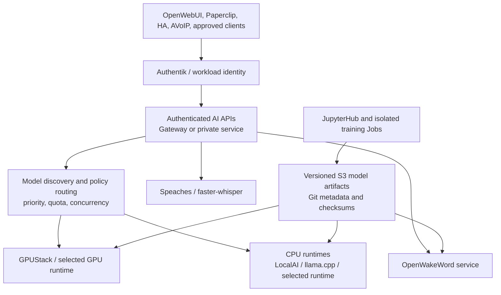

# CoRE AI platform plan

**Planning baseline: 2026-10-09.** This document defines the detailed AI
architecture and staged roadmap. The [root portfolio plan](../PLAN.md) owns
cross-domain priorities; [AI/TODO.md](TODO.md) owns AI task status and evidence.
This plan records selected directions and candidates separately from existing
code and operational acceptance.

## 1. Existing AI services

The [AI chart](Chart.yaml), [values](values.yaml), [templates](templates/)
and [operational README](README.md) provide the implementation evidence.
Current values are defaults, not effective production values. The current
Backplane owners are the [AI ApplicationSet](https://slop.writemy.codes/CoRE/CoRE-Backplane/src/branch/main/Apps/Business/Tools/AI.yaml)
and [AINode2 ApplicationSet](https://slop.writemy.codes/CoRE/CoRE-Backplane/src/branch/main/Apps/Business/Tools/AINode2.yaml),
both rendering `AI/` through Lovely into `core-ai-prod`. AI owner values enable
MCP and cluster identity; AINode2 injects LocalAI and llama enablement. The
owners select YVR bare-metal infrastructure and all matching bare-metal
infrastructure respectively. Neither ApplicationSet proves runtime health.

| Service | State and role | Evidence boundary |
| --- | --- | --- |
| GPUStack | **Implemented — repository verified; deployment configured.** Model management/inference server, Authentik OIDC integration, optional worker and API-key management. | Check actual workers, available models, GPU resources and external URL at each selected cluster. |
| llama.cpp | **Partial.** AI templates expose a llama workload path, enabled by AINode2 values. | Actual model and backend configuration may be supplied outside local defaults. Do not infer its active model inventory from empty `llama.models`. |
| LocalAI | **Partial.** LocalAI workload support is in `AI/`; local default disables it, while AINode2 injects `localai.enabled: true` and `llama: true`. | Verify effective rendered resource, node, model and API configuration. `LocalAI/` at repository root is not independently proof of a deployed runtime. |
| Speaches / faster-whisper | **Implemented — repository verified; deployment configured.** CPU and CUDA backend templates, shared cache PVC, Gateway route and session affinity. Default model is `Systran/faster-whisper-small`. | README says tags `0.8.3-*` and equal routing; checked-in values say `latest-cpu`, `0.9.0-rc.3-cuda` and weights 1/99. Resolve with owner merge/render and observed image digests before asserting effective version or split. |
| Wyoming OpenAI bridge | **Implemented — repository verified.** Two replicas in default values; it adapts Wyoming to OpenAI-compatible STT/TTS endpoints. | Mutable `latest` default; verify effective image, service protocol, target endpoints and live Home Assistant connectivity. It is not itself wake-word detection. |
| TTS | **Partial.** Optional Kokoro GPU backend, disabled in the local values; separate Wyoming bridge currently points its TTS API at GPUStack. | Do not equate optional TTS chart backend with existing configured GPUStack synthesis. Verify model IDs, routes and Voice Assistant consumers. |
| OpenWebUI | **Implemented — repository verified; deployment configured.** Authentik, PostgreSQL User claim, Dragonfly and Gateway integration. | Inspect the site-local deployment and current group/entitlement state before claiming user access. |
| MCP | **Partial.** MCP routes/services and Brave Search secret integration exist; application-specific enablement is merged by the AI owner. | Tool auth, authorization granularity and audit are not a general platform contract yet. |
| Paperclip | **Implemented — repository verified; configured for a specific site.** Agent orchestration with PostgreSQL, persistent local data and Authentik OIDC application support. | Single-replica persistent app is not a general multi-tenant CoRE agent platform; OIDC setup includes post-deployment UI configuration. |
| OpenWakeWord, microWakeWord, JupyterHub | **Planned.** Selected future work, with no implementation in this chart. | Hey Jarvis on Voice PE is user-reported device behavior, not a server-side model deployment. No Hey CoRE artifact or training pipeline is verified. |

The Backplane supplies shared PostgreSQL, Dragonfly/Valkey, S3, Gateway,
Auth, GPU scheduling/runtime components and observability. CoRE-Business must
not instantiate duplicates. See the root plan for ownership and shared
platform dependencies.

## 2. Target architecture

Provide authenticated, versioned, observable AI APIs that applications can
consume across site boundaries with deliberate locality. Separate model
management from inference, inference from training, and AI output from action
authorization. Start with existing GPUStack, LocalAI/llama.cpp and Speaches;
add a runtime only when an evaluated workload has a measured unmet requirement.

## 3. Multi-runtime inference

**Purpose.** Serve text, embedding, speech and wake-word workloads over
stable APIs while using heterogeneous older Xeon systems and RTX 2070/2080
class GPUs efficiently and leaving room for future accelerators.

**Current path.** GPUStack is the chart's model-management server; llama.cpp
and LocalAI are optional workload integrations; Speaches hosts faster-whisper
for speech; Wyoming exposes selected STT/TTS capabilities. API-compatible
interfaces exist in several applications, but a unified cross-runtime routing
policy is not yet established.

**Target.** Maintain a compatibility matrix and route by task, model,
hardware, privacy boundary, latency SLO, capacity and site locality. Support
OpenAI-compatible endpoints where they fit, without hiding backend-specific
features. Candidate runtimes include [GPUStack](https://gpustack.ai/),
[llama.cpp](https://github.com/ggml-org/llama.cpp),
[vLLM](https://docs.vllm.ai/) and [SGLang](https://docs.sglang.ai/);
vLLM/SGLang are comparison candidates, not selected deployments. Quantized
models are first-class where quality remains acceptable.

**Evaluation gate.** Use identical datasets and prompts; measure time to first
token, end-to-end p50/p95 latency, tokens/s, concurrent requests, memory,
model load/cold-start time, crash/isolation behavior, cost/power estimate,
hardware utilization, supported features, model/license compatibility and
operational burden. Include load saturation and graceful queuing tests.
Select one runtime per workload class rather than deploying every framework.

**Operations and failure.** Model discovery returns availability and version;
admission applies per-identity priority/concurrency limits. Define queue
limits and timeout behavior, warm/cold replica strategy, cache placement,
draining, eviction and fallback. A model unavailable at one site may use a
remote site only where data policy, bandwidth and measured latency allow it.
No unbounded request retry or silent downgrade to a less private model.

## 4. Model deployment and lifecycle

Store immutable model versions and manifests in existing S3-compatible
platform storage where possible. Git carries small metadata and promotion
records; object storage carries model bytes. Evaluate Harbor OCI artifacts if
they improve existing CI/provenance workflows. A new registry database is not
assumed necessary.

Every artifact records model and runtime name/version, content checksum,
format (for example GGUF, ONNX or TFLite), quantization, tokenizer/config,
hardware requirements, dataset/training commit references, evaluation report,
licensing and redistribution constraints, creator/tool versions, compatibility
and promotion state. Promote through development, evaluation and approved
production channels. Rollback selects a prior immutable manifest and verifies
that the old runtime can still load it. Never overwrite a published version.

Model loading/caching needs quotas, cache locality, download integrity,
preload readiness, eviction policy and disk-space alerting. Secret-bearing
model providers, private training data and access tokens remain in managed
secrets, not model metadata or logs.

## 5. OpenWakeWord streaming service

**Selected direction.** Run OpenWakeWord server-side, CPU-first, with initial
“Hey Jarvis” evaluation and “Hey CoRE” as the first custom phrase candidate.
The user reports that their Home Assistant Voice Preview Edition currently
uses “Hey Jarvis”. Its ESPHome `micro_wake_word` configuration resolves an
embedded model during firmware build. That is a separate implementation from
server OpenWakeWord; do not mistake its firmware asset for an OpenWakeWord
ONNX artifact or assume conversion between runtimes.

**Proposed service contract (not yet implemented):** authenticated WebSocket
session; one independent session state per stream; PCM16 little-endian, mono,
16 kHz chunks with sequence/timing and bounded buffering; model discovery and
version selection; configurable thresholds, cooldown and end/reset behavior;
health/readiness; detection events containing model/version, session, event
time, score, threshold and correlation metadata. Raw audio is not persisted by
default. Prefer separate event and audio channels and reject malformed,
oversized, stale or unauthorized streams.

Authentication may use service identity/mTLS for service-to-service and
OIDC-issued client access where appropriate; the exact handshake, token
refresh and browser/device pattern require a decision. Public anonymous audio
ingress is not acceptable. Sessions need limits on duration, throughput,
concurrency, backpressure and model selection. Thresholds/cooldowns are
versioned configuration, not values baked into an untracked runtime image.

Scale CPU replicas from measured concurrent streams, not request rate alone;
ensure sticky/session-aware routing or explicitly route each stream to its
state owner. Readiness requires model loaded and compatible. Horizontal scaling
must not duplicate detection events. Metrics include active streams, audio
frames and durations, dropped/late frames, queue depth, model load/error,
detection counts/scores by model (without audio or personal transcript), CPU,
memory, latency and auth failures. Keep high-cardinality user/call identifiers
out of metric labels.

## 6. microWakeWord embedded model pipeline

Use the upstream [microWakeWord framework](https://github.com/kahrendt/microWakeWord)
to train and export ESP32-compatible quantized TFLite artifacts, then package
the model manifest and model data as ESPHome expects. Confirm the actual
Voice PE build supports the chosen format, sample characteristics and model
configuration. Measure flash/RAM, inference latency, sensitivity, false
accepts, false rejects and device responsiveness at target firmware settings.

Firmware integration must preserve currently working Hey Jarvis, Okay Nabu,
Hey Mycroft and Stop behavior unless an explicit device-level decision changes
it. Use reproducible pinned ESPHome builds and maintain an OTA rollback image.
Validate microphone gain, room acoustics and user sensitivity calibration.
OpenWakeWord ONNX/server models and microWakeWord TFLite/embedded models are
separately trained/versioned artifacts; only shared data/evaluation methods
may be reusable where compatibility is proved.

## 7. Shared training datasets

Training needs licensed/consented positive samples, hard negatives, synthetic
speech, multispeaker variation, room/noise augmentation, quiet and reverberant
conditions, and telephony-specific band-limiting/codec/packet impairment
augmentation. Track speaker and source provenance, demographic/audio bias,
consent scope, licensing, de-identification and deletion requests. Store
datasets in restricted S3 with lifecycle policy, checksums and access logs.

Keep train/validation/held-out test speakers and recording sessions separate
to avoid leakage. Publish evaluation reports with false accepts per hour,
false rejection rate, time-to-detect, CPU and memory, model size, and breakdown
by microphone, speaker/noise group and channel (device vs telephony). Set
acceptance thresholds before training. The initial Hey CoRE is **untrained**
until it has a real artifact and evidence from that held-out protocol.

## 8. Model registry and artifact storage

Implement a minimal registry first: immutable S3 object paths, checksums,
signed or CI-attested manifest, licensing, training commit/dataset references,
runtime compatibility, evaluation report and promotion/rollback metadata. The
Git repository should not contain large binaries or protected audio. Test
restore/download from each intended site. Compare Harbor's OCI artifact
workflows with S3-plus-Git before selecting a service. Artifact provenance must
connect the data version, training code, dependencies and produced runtime
artifact.

## 9. JupyterHub and developer workspaces

JupyterHub with [Authentik](https://goauthentik.io/) OIDC and
[KubeSpawner](https://jupyterhub-kubespawner.readthedocs.io/) is the selected
notebook/training direction. Provide user-scoped CPU profiles first and
controlled GPU training profiles later. Use reproducible image versions,
per-user storage, namespace/resource quotas, idle culling, managed credentials,
S3 dataset roles, CI-built images, notebook provenance, job submission and
checkpoint retention. A Kubernetes Job—not a long-lived notebook pod—should
own repeatable training/evaluation runs.

Notebooks are not full IDEs. Assess Eclipse Che or code-server only if
TypeScript/Go/Python and infrastructure development require interactive
features that JupyterLab cannot provide. Define shared user identity, image,
network, storage, quota, secret and audit contracts across workspace types.

## 10. GPU scheduling and training Jobs

Backplane owns GPU operators, device plugins, RuntimeClasses and node labels;
AI consumes declared capacity. Inventory older Xeon nodes and RTX 2070/2080
class GPUs, supported driver/CUDA/runtime stack, shared GPU accounting and
per-site resource limits before assigning profiles. Reserve inference
capacity and priority for speech/KWS; training uses lower-priority, bounded
jobs and checkpoints. Test preemption/eviction, GPU sharing, OOM behavior,
node loss, checkpoint restart, cache pressure and fairness. Track job queue
wait, GPU utilization, memory and completed useful work—not utilization alone.

## 11. Wyoming and Home Assistant integration

The current chart's Wyoming OpenAI bridge points STT at the Speaches
OpenAI-compatible API and TTS at GPUStack. Confirm the bridge protocol and
current upstream implementation before upgrading; pin its image after the
effective owner values are known. Keep three functions distinct: Home
Assistant/Wyoming STT/TTS, OpenWakeWord server streaming, and embedded
microWakeWord detection. A Wyoming adapter may be evaluated if it reduces
client coupling, but do not claim Wyoming itself detects wake words.

Home Assistant should discover only authenticated endpoints supported by the
actual installation. Verify TLS, model IDs, stream behavior, retry/timeouts,
privacy settings and endpoint failure behavior with the target HA version.

## 12. ESPHome Voice Preview integration

Use the upstream [Home Assistant Voice PE project](https://github.com/esphome/home-assistant-voice-pe)
and ESPHome firmware configuration as the device authority. Inventory its
current microWakeWord model list, sensitivity and model build provenance.
Keep existing Jarvis behavior by default. Pilot a Hey CoRE model on one
non-critical device with firmware/model checksums, configuration backup,
OTA health check and a tested previous image for rollback. Verify wake
latency, false triggers/hour, false rejection and voice pipeline completion in
the user's actual environment. Do not move the embedded model to server
inference unless device and network behavior are intentionally changed.

## 13. AVoIP caller-audio processing

The selected lab flow is described in the [portfolio plan](../PLAN.md#9-avoip-and-programmable-communications).
Kamailio owns SIP routing; RTPEngine owns anchored media; FreeSWITCH executes
call actions on its call/channel; Asterisk retains current PBX functions.
The current Kamailio templates call `rtpengine_manage` for normal offer/answer
and dialog media handling. The fetched [AVoIP ApplicationSet](https://slop.writemy.codes/CoRE/CoRE-Backplane/src/branch/main/Apps/Business/AVoIP.yaml)
shows site-specific AVoIP placement. No caller-audio PCM adapter or wake-word
media fork is currently evidenced in `AVoIP/` or `AI/`.

Before implementation, prove on the deployed RTPEngine build that it can
subscribe/fork a selected call participant's stream to a controlled sink
without changing the original forwarding. Specify payload format, codec
decode/transcode point, timing, RTP headers, security, packet loss and
direction labels. The adapter must identify caller direction correctly,
convert to PCM16 mono 16 kHz, bound queues and drop analysis frames rather than
block RTP. Authenticate RTPEngine control and media sink traffic and isolate
the adapter's network policy from public media services.

An authenticated AVoIP controller maps Call-ID/tags and RTPEngine owner to
FreeSWITCH UUID/channel ownership, accepts signed/authorized detection events,
checks the call is opted in and still active, deduplicates event/action IDs,
enforces an action allowlist and asks the owning FreeSWITCH worker to play/mix
the GG test sound to extension 7102. Event delivery is not telephony
authorization. Stop the subscription at hangup, reject stale events, audit
metadata but not audio, and fail without altering the call when inference or
controller is unavailable. Preserve explicit operator disable and one-call
lab scope. The exact RTPEngine N-G protocol client, FreeSWITCH control API,
dialog identity and owner/failover semantics are open integration decisions.

## 14. Knative, Temporal and AI functions

Knative may run stateless authenticated HTTP/event handlers with scale-to-zero;
Temporal may orchestrate durable long-running AI/research/business workflows.
Evaluate both against the shared operator and gateway state in Backplane
before choosing service patterns. Keep OpenWakeWord streaming warm and
session-stable; do not put its active audio session behind scale-to-zero.
Keep an RTP action on the owning FreeSWITCH process. Temporal can schedule a
callback after the call or wait for approval, but it must not own a real-time
media clock or retry a non-idempotent live call action.

## 15. Agent orchestration and tool security

OpenWebUI, Paperclip, n8n and MCP integrations have distinct present roles.
Inventory their effective authorization before adding another agent
framework. For a planner/executor/final-response pattern, use a private
planning model for reasoning, a separately controlled tool executor enforcing
allowlisted schemas and permissions, and a response model that sees only
approved results. The planner never carries production credentials.

Each tool call needs user/tenant identity, scope, purpose, approval policy,
idempotency key, timeout, audit event, output size limit and revocation path.
Test prompt injection in documents, tool permission escalation, cross-tenant
retrieval, secret/data exfiltration, replay and unintended writes. Require
human approval for high-impact external actions; no agent may make live
payments or money transfers automatically.

## 16. API contracts

| API | Proposed contract | Status / gate |
| --- | --- | --- |
| Model inference | Authenticated OpenAI-compatible API or explicit task API; model ID/version, max tokens/input size, timeout and policy limits. | Existing pieces vary by runtime. Inventory compatibility and stable service identity before a universal gateway. |
| STT/TTS | Existing OpenAI-compatible `/v1/audio/transcriptions` and `/v1/audio/speech` pathways; Wyoming adapter for supported clients. | Verify effective route/owner values and selected models. |
| Wake stream | Authenticated WebSocket PCM16 mono 16 kHz with session/model lifecycle and bounded chunks. | Proposed. Specify resampling responsibility, keepalive, backpressure and auth before implementation. |
| Detection event | Versioned JSON metadata: event ID, model/version, session, timestamp, score/threshold, optional correlation ID and expiry. No raw audio. | Proposed. Define signing, replay window, dedupe and privacy before connecting an action controller. |
| Model manifest | Immutable ID, checksum, runtime/format, license, source/training metadata, hardware compatibility, evaluation and promotion state. | Proposed. Git plus S3/Harbor choice pending. |
| Agent tool | Authenticated, schema-validated request with actor, scope, approval, idempotency and audit. | Existing MCP providers need capability-specific audit and authorization review. |

## 17. Observability and performance

Standardize Prometheus metrics, logs and traces through the platform's
Backplane-owned Mimir/Prometheus, Loki and Tempo-compatible systems. Monitor
per model/runtime request count, success/error, p50/p95 latency, queue/concurrency,
tokens or audio seconds processed, load time, cache hit/eviction, CPU/GPU/memory,
GPU OOM, stream drops and readiness. Use safe cardinality and no transcripts,
audio or secrets by default. Include model version and site as bounded labels.

Wake-word quality has product metrics (false accept/reject and time-to-detect)
that infrastructure metrics cannot replace. Establish offline corpus and
controlled opt-in field tests. Define alert thresholds from measured baseline
and user impact; a pod Ready condition alone is not acceptance.

## 18. Deployment boundaries

AI chart/application implementation stays in CoRE-Business. Backplane owns
the [AI](https://slop.writemy.codes/CoRE/CoRE-Backplane/src/branch/main/Apps/Business/Tools/AI.yaml)
and [AINode2](https://slop.writemy.codes/CoRE/CoRE-Backplane/src/branch/main/Apps/Business/Tools/AINode2.yaml)
ApplicationSets and injects environment/site values. Backplane additionally
owns GPU scheduling support, gateways, DNS, storage, data services, S3, Vault,
Authentik, cluster policy and shared monitoring. A future OpenWakeWord service
is an application service; a new shared GPU operator, S3 tenant, Gateway or
site route is not. Any new privileged service identity, database claim, S3
bucket, route, runtime class or network policy needs its owning layer reviewed.

Use a private route/service unless a documented consumer requires external
access. Public voice/audio ingress is not acceptable as a shortcut to service
connectivity. Respect least-privilege namespaces, Cilium policies, user claims,
explicit Dragonfly allocations, durable artifact retention, and Longhorn/S3
backup owners. Ensure no model registry or notebook template ships credentials.

## 19. Failure modes

| Failure | Required behavior |
| --- | --- |
| Model missing/corrupt or license/compatibility check fails | Mark model unready; do not accept sessions; preserve other models and caller call. |
| Wake stream auth or session limit fails | Reject that stream, emit safe audit/metric; do not degrade unrelated streams. |
| Inference overloaded or late | Bound and drop stale frames; no unbounded buffering; call media forwarding remains independent. |
| Event duplicated, stale or after hangup | Controller rejects by event ID, expiry and live owner mapping; no media action. |
| FreeSWITCH/RTPEngine owner unavailable | No action; do not replay to arbitrary worker; record explicit unsupported failure and preserve established session behavior where possible. |
| Site/network/storage failure | Use only verified local/remote model and artifact paths; no assumption of cross-site write or active session recovery. |
| Training Job or notebook resource pressure | Quota/preemption limits training; production speech reserve remains available; checkpoint and retry according to phase policy. |
| Dataset/artifact compromise or deletion | Verify checksum/provenance, revoke promotion, select previous immutable version and restore from tested backup. |

## 20. Milestones and acceptance criteria

Milestone IDs and status are authoritative in [AI/TODO.md](TODO.md); root
[TODO.md](../TODO.md) carries portfolio summaries only.

| Milestone | Desired evidence |
| --- | --- |
| AI-001 — inventory and contract | Effective AI render/config per owner and cluster; service/model/version inventory; gaps documented. |
| AI-002 — OpenWakeWord service | Authenticated live PCM stream, model loaded, independent sessions, detection event; bounded load; metrics; no raw-audio persistence. |
| VOICE-001 — Hey CoRE OpenWakeWord | Reproducible versioned artifact, checksums/license/provenance, held-out false accept/reject and latency report. |
| VOICE-002 — microWakeWord | Compatible quantized model, ESPHome build manifest, target-device memory/latency/sensitivity data and OTA rollback. |
| AI-003 — registry | Immutable S3/Harbor artifact lifecycle with promotion and verified rollback. |
| AI-004 — JupyterHub | Authentik login, isolated profiles/storage/quotas, repeatable training Job, no production AVoIP credential access. |
| AVOIP-AI-001 — caller audio lab | Opted-in caller-only PCM feed, correlated event, authorized/unique FreeSWITCH mix request to 7102, RTP unchanged, no recording, detector outage harmless. |
| AI-005 — broader platform | Benchmark-based inference selection; secured functions/workflows/agent or RAG pilot with bounded authority and audit evidence. |
