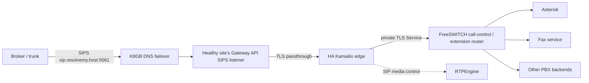
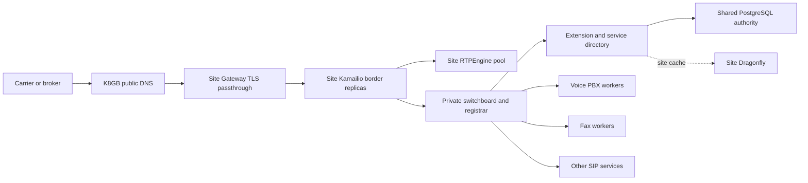

# AVoIP SIP routing architecture

## Goal

Present one stable public SIP identity, `sip.resolvemy.host`, to carriers and
brokers. Route calls through a highly available SIP edge at the selected site,
then use private site-local SIP routing to reach call-control and endpoint
services. Public peers must not need internal Kubernetes names, backend PBX
addresses, or private route-set entries.
The [SIP HA options](SIP-HA-OPTIONS.md) compare the registration, storage,
authentication, switchboard, dialog, and media choices and give the proposed
order of implementation.

## Target call path



The public edge terminates TLS in Kamailio. Gateway API and Envoy pass the
encrypted SIPS stream through. Kamailio owns the public Contact and
Record-Route identity, validates carrier sources, and routes to private
services. RTPEngine anchors RTP independently; its media address and port
ranges are not part of SIP identity or backend routing.
The chart user supplies each site's LoadBalancer class and annotations. The
active [AVoIP ApplicationSet](https://github.com/K-FOSS/CoRE-Backplane/blob/main/Apps/Business/AVoIP.yaml)
currently selects PureLB annotations for DC1 and kube-vip UPnP forwarding for
home1, with different public media addresses. The chart must not set either
provider policy itself or reuse the SIP ingress address as the RTP address.

## Current chart behavior

The active [AVoIP ApplicationSet](https://github.com/K-FOSS/CoRE-Backplane/blob/main/Apps/Business/AVoIP.yaml)
renders this chart with Lovely and injects cluster identity, site-specific SIP
hostname, component enablement, media address/range, and DID values. Its
current DC1 and home1 entries both enable Asterisk and FreeSWITCH. The local
chart defaults alone are not the deployed configuration.

- Public ingress uses a site-specific `TLSRoute` and site-specific public SIP
  identity by default.
- Kamailio forwards inbound calls to one configured private FreeSWITCH service
  over TLS. FreeSWITCH chooses its Asterisk voice gateway or local fax handler
  using the site-injected DID values. DIDs remain out of this repository.
- Kamailio inserts private and public Record-Route values for the internal
  exchange, strips the private route from replies sent to the carrier, and
  rewrites public Contacts while preserving the SIP user. The public peer sees
  only the public route and target.
- Kamailio, FreeSWITCH, and RTPEngine render one replica each by default.
  FreeSWITCH has a persistent fax spool and local call
  channels; it is not scaled by the SIP edge change. The RTPEngine Valkey
  deployment supplies shared media-session storage but does not increase the
  media proxy replica count by itself.
- The chart has an opt-in K8GB mode. It creates a global-only TLSRoute,
  `Gslb`, and `ZoneDelegation`; when enabled it switches the public Kamailio
  listener, Contact, and Record-Route to `sip.resolvemy.host`. It remains off
  until the Backplane DNS delegation and provider path is ready. Its current
  `doFinalize: false` setting keeps K8GB from deleting the parent DNS
  delegation when the `ZoneDelegation` is removed, so parent DNS cleanup stays
  an explicit operator task.

FreeSWITCH currently provides the local voice/fax switchboard: it sends the
voice DID to Asterisk and handles the dedicated fax DID locally. Its private
Asterisk SIP profile is configured to query the Authentik-backed LDAP
directory and require SIP authentication. The rendered configuration alone
does not prove the required SIP verifier attributes exist or that a live
registration would succeed. An optional static switchboard map now routes
exact usernames/extensions from that private profile to named TLS backends.
The chart has no general SIP registrar, dynamic contact store, or public
username/extension router, and FreeSWITCH call channels remain local to one
process. These are existing deployment gaps, not enabled HA features.

## Target functional layers



The Kamailio border is the public SIP and topology boundary. The private
switchboard owns initial extension selection and a directory of service names,
users, and extension aliases. Service workers can be multiplied for new calls;
an established call stays bound to the worker that answered it. Each site's
RTPEngine pool anchors that site's media. Public DNS failover chooses the site
for new calls. A backup RTPEngine can take over only to the extent that its
shared media-session state, network address/port reachability, and peer RTP
path have been verified; a different site's advertised media IP cannot replace
an established peer RTP destination merely because DNS changes.

### State stores and ownership

The [PostgreSQL ApplicationSet](https://github.com/K-FOSS/CoRE-Backplane/blob/main/Apps/Storage/PSQL.yaml)
currently makes home1 the writable hub with three replicas and DC1 a standby
with one replica. PostgreSQL is the candidate authority for extension names,
service identities, policy, and routing ownership. Its current cross-site
topology does not by itself prove automatic promotion or simultaneous writes
after home1 loss. A chart consumer must use a `User.mylogin.space` claim and
its generated connection Secret, as described by the
[User XRD](https://github.com/K-FOSS/CoRE-Backplane/blob/main/Operations/SSO/User/templates/User/UserResourceDef.yaml),
and must be tested through the writable pooler and promotion path before being
used in the call setup critical path.

The [site-local Dragonfly ApplicationSet](https://github.com/K-FOSS/CoRE-Backplane/blob/main/Apps/Storage/Dragonfly/CoRE.yaml)
provides a TLS-enabled Redis-compatible cache at each site. It does not
replicate the same logical database between YVR and YXL, so it can cache
directory lookups or short-lived presence within one site but cannot alone
decide cross-site dialog ownership. Any new consumer must reserve a unique
database in the [Dragonfly allocation registry](https://github.com/K-FOSS/CoRE-Backplane/blob/main/Storage/Dragonfly/CoRE/README.md)
and use that site's published credential reference. The chart's existing
Valkey cluster and primary-aware proxy belong to RTPEngine's media-session
recovery; sharing database `0` with SIP registration or switchboard keys would
mix lifecycles and failure domains.

Registration contacts need their own defined durability, expiry, and
site-ownership model. A persistent Kamailio `usrloc` database is one option,
but registration and lookup modes must be selected together so replicas see
current contacts. Do not infer live registration from a stored username or
publish one site's private Contact as a global target. The [registrar](https://kamailio.org/docs/modules/stable/modules/registrar.html)
and [usrloc](https://kamailio.org/docs/modules/stable/modules/usrloc.html)
modules document the contact and persistence semantics.

### Registration and Authentik

Separate identity enrollment from SIP registration. Authentik can own service
accounts, group membership, extension assignment, and revocation. SIP
`REGISTER` normally uses digest authentication, which needs a SIP-specific
HA1 verifier for a fixed realm or a server that can verify the full SIP digest
challenge. The existing FreeSWITCH LDAP integration maps the custom
`fsPassword` and `fsA1Hash` attributes; its current private Asterisk profile
queries that directory with the chart's `User` claim. The Backplane
[User implementation](https://github.com/K-FOSS/CoRE-Backplane/blob/main/Operations/SSO/User/README.md)
says its `AVoIP` claim field is not consumed, so the presence and lifecycle of
those custom SIP verifier attributes must be verified before relying on them.
This is not a general
Kamailio registrar and should not be exposed through the public carrier ACL.

Authentik's [RADIUS provider](https://docs.goauthentik.io/add-secure-apps/providers/radius/)
currently supports PAP and EAP-TLS authentication; it does not provide a
demonstrated SIP digest verification path for the Kamailio
[auth_radius module](https://kamailio.org/docs/modules/stable/modules/auth_radius.html).
An LDAP bind also cannot verify a SIP digest response without access to the
appropriate SIP verifier. Do not reuse an interactive Authentik password as a
rendered SIP password or turn off digest/TLS verification. A production
registrar needs a dedicated credential provisioning/revocation flow, a
consistent realm, a trusted private REGISTER ingress, and tests for duplicate
contacts, expiry, revocation, and failover. Use mTLS service identities where
both ends support them; keep carrier ingress source-validated and separate.

The concrete first client is the existing Asterisk service. Before enabling a
Kamailio registrar, provision a SIP verifier for its Authentik-managed `User`
credential without exposing the password in Helm output, create the matching
Kamailio PostgreSQL location schema through a migration tied to the pinned
image version, and wire a private TLS listener and Service that public Gateway
routes cannot reach. Use Kamailio `usrloc` database-only mode or another
demonstrably coherent contact-sharing mode so either Kamailio replica reads a
fresh registration. The current chart does none of these steps yet; merely
setting Asterisk to send REGISTER to the existing public carrier listener
would be incorrect.

The proposed first registration transaction is: Asterisk connects by TLS to
the site's private Kamailio registrar; Kamailio challenges and verifies the
site-specific Asterisk service identity; `registrar` writes its Contact to
PostgreSQL-backed `usrloc`; either Kamailio replica can then look up that
Contact. Use a site-qualified realm/AoR so YVR and YXL Asterisk instances
cannot overwrite one another's registrations while using the same extension
names and DIDs. The initial INVITE selects the Contact in the owning site,
and Record-Route keeps subsequent dialog requests with that selected service.
Provision the location tables from the schema matching the pinned Kamailio
release, such as its [PostgreSQL usrloc schema](https://github.com/kamailio/kamailio/blob/6.1/utils/kamctl/postgres/usrloc-create.sql),
through an idempotent migration rather than relying on a pod-local database.

### Switchboard contract

The first chart layer is `freeswitch.switchboard.backends` and
`freeswitch.switchboard.routes`: explicit private TLS backend names and exact
username/extension mappings. When routes are configured, the ACL-restricted,
LDAP-authenticated Asterisk Sofia profile enters the `switchboard` context;
with an empty map it keeps its existing context. The carrier-facing Kamailio
profile remains in `public`. Unknown switchboard users are rejected. This map
is static and does not imply backend health checking, registration, or
multi-worker balancing. A later directory/registrar layer must add backend
health, capacity, and authorization identity. Initial selection may then
balance among healthy workers. The selection must remain stable for ACK, BYE,
UPDATE, re-INVITE, INFO, REFER, and subsequent requests, including requests
that land on the other Kamailio replica. Store only the minimum owner/backend
mapping or carry an opaque signed routing token; never publish backend service
names to the carrier. Route all backend-originated requests through the
private edge.

For an opt-in private route, chart users can supply a mapping of this shape:

```yaml
freeswitch:
  switchboard:
    backends:
      - name: 'operator'
        host: 'operator.core-prod.svc.k8s.home1.resolvemy.host'
        port: 5061
    routes:
      - user: 'alice'
        backend: 'operator'
        targetUser: 'alice'
```

The backend must already provide a TLS SIP service and a certificate valid for
its hostname. The chart does not create that backend or provision its service
identity. Values are validated for duplicate names/users, unknown backends,
unsafe URI characters, and invalid ports. The route is reached only through
the existing Asterisk Sofia profile, whose source ACL and LDAP authentication
must both succeed. This is a private service route, not a carrier DID rule or
a public SIP registration endpoint.

The first deployed backend-registration rollout should keep existing DID and
fax behavior unchanged, use Asterisk's existing `User` service identity as
the first SIP REGISTER client, store and look up its contact through a shared
registrar backend, and prove both edge
replicas resolve the same contact after one replica restarts. Only then should
the optional static switchboard mapping be used for that service. Expand to
multiple backends only after registration, routing ownership, and backend
failure semantics are measured.

## Edge availability and dialog handling

Kamailio currently runs one replica per site behind its Kubernetes Service.
Dialog traffic follows standard loose routing, with no method-specific ACK
forwarding. A pod restart can interrupt active calls. Adding more replicas
requires verified dialog affinity and failover behavior; see the
[SIP HA options](SIP-HA-OPTIONS.md). K8GB DNS failover, when enabled, directs
new calls to a healthy site but does not migrate active dialogs.
An active call still depends on the site-local SIP, PBX, and RTP state that
accepted it.

### Shared routing state and failover boundary

The current Kamailio configuration does not load a dialog, topology-hiding,
location, or database module. It does not write SIP dialog state to a shared
store. The initial request establishes a SIP route set in SIP headers, and
each replica applies the same routing script. This is enough for either
same-site Kamailio replica to process a request when it arrives there, but it
does not replicate transaction state, TLS/TCP connections, FreeSWITCH channel
state, or RTPengine media sessions.

The target should make the distinction explicit:

| State | HA approach | What failover can provide |
| --- | --- | --- |
| Kamailio configuration and backend registry | Identical versioned configuration at both sites | Either site makes the same routing decisions |
| Dialog-to-site/backend routing ownership | Portable route token or a purpose-built HA routing registry | Another edge can identify the call's original site and backend |
| SIP transaction and TLS connection state | Remains local to the process/connection | Cannot be resumed by another Kamailio process; SIP peers must retry/reconnect |
| FreeSWITCH/PBX call channels and RTPEngine session | HA behavior of those services, independently designed | A shared Kamailio store alone cannot preserve the established media/call leg |

For cross-site routing, do not rely on an in-memory Kamailio dialog table or
Kamailio DMQ as the sole failover mechanism. Kamailio's documented dialog DMQ
replication currently synchronizes only basic information and explicitly does
not allow in-dialog requests to be handled by a node other than the original
proxy. A database-backed dialog table can persist dialog metadata, but it does
not move a live SIP transaction, transport connection, FreeSWITCH channel, or
RTPengine session. See the [dialog module's DMQ limitations and database
storage](https://kamailio.org/docs/modules/stable/modules/dialog.html).

The preferred routing design is to keep carrier-visible identity and route
sets at the public SIP edge, while making the selected site/backend recoverable
by any eligible edge. Evaluate these two mechanisms before implementation:

1. Put a compact, integrity-protected site/backend routing token in the
   public Record-Route URI. Every site can decode it and route the next dialog
   request over the private inter-site path to the original call owner. The
   token must not expose Kubernetes names or credentials, and its format/key
   rotation must be versioned.
2. If the route token cannot safely carry the required selection, keep a
   minimal dialog-owner registry in a genuinely highly available datastore
   reachable from both sites. Store only data needed to recover routing
   (dialog key, owner site, backend identity, and expiry); do not treat this as
   a replica of SIP transactions or PBX/media state. The datastore's owner,
   failure policy, consistency, and cross-site availability must be selected
   from the deployed Backplane storage configuration before adding chart
   persistence or a new dependency.

Prefer route-token recovery when it can provide the required routing without
a cross-site database lookup on every in-dialog request. In either design,
the site that owns the FreeSWITCH/PBX call leg must remain reachable for the
dialog's lifetime, or that call-control and media layer must separately
support takeover. If the owner site and its call-control state are lost, the
other SIP edge can reject or report the broken dialog cleanly, but it cannot
recreate the active call from routing metadata. This is failover of SIP edge
routing, not seamless active-call migration.

The implementation must create/replicate the routing ownership before
forwarding an INVITE that can be answered, remove it on BYE or timeout, and
retain it long enough for normal dialog retries. Test the race where ACK
arrives immediately after 200 OK, node loss during dialog establishment,
site loss after answer, and normal BYE cleanup. Keep media anchoring and its
public address unchanged while validating signaling ownership.

Kamailio currently routes to one FreeSWITCH Service rather than a configurable
pool of different PBX types. The next routing layer should make named private
backends and extension rules declarative in Helm values, while leaving
carrier-facing identity and topology at Kamailio. Initial rules should preserve
the current voice-to-Asterisk and direct-fax behavior. New backends should use
site-local Service DNS names and TLS; no pod IPs or ClusterIPs belong in values.

For backend pools, dialog affinity must be explicit: an initial INVITE may be
balanced to a backend, but subsequent ACK, BYE, UPDATE, re-INVITE, and other
dialog requests must return to that same backend. A stateless dispatcher alone
does not preserve dialog state. The current single FreeSWITCH service avoids
that extra selection state.

## Public identity and topology hiding

The carrier should use only `sips:sip.resolvemy.host:5061;transport=tls` once
K8GB mode is activated. Its DNS answer selects the serving site. The global
TLSRoute is separate from the site-local TLSRoute so the K8GB resource refers
only to the global hostname. Both routes target the same site's Kamailio
Service.

Keep the private Kamailio-to-FreeSWITCH service name and TLS listener on the
internal side. Do not put private Service names in carrier-visible Contacts or
Record-Route values. A direct site-specific carrier fallback is not
automatically safe when the response advertises the global route: subsequent
in-dialog requests resolve the global hostname and must return to the site
handling the dialog. Use the global target for carrier traffic unless provider
failover and global DNS health selection are coordinated.

The current explicit Record-Route filtering and Contact rewriting are the
topology boundary. Do not add Kamailio `topoh`/`topos` until packet captures
show another private header or URI escaping the public edge and HA key/state
requirements are designed.

## Rollout sequence

Follow the staged implementation and proof in
[SIP HA options](SIP-HA-OPTIONS.md#recommended-order-and-proof). Keep the
current DID and fax routes while introducing private registration, then prove
backend affinity before turning on the global public dialog identity.

## Verification

Render both site values and inspect the public `TLSRoute`, `Gslb`,
`ZoneDelegation`, Kamailio listener/route set, replica count, disruption
budget, private Service targets, and RTPEngine public media address. Test
global DNS failover and real SIP ACK/dialog traversal after the K8GB DNS path
is enabled. Static Helm output does not demonstrate DNS or live call failover.

Upstream references: [Kamailio](https://www.kamailio.org/) and its
[dialog](https://kamailio.org/docs/modules/stable/modules/dialog.html),
[Dispatcher](https://kamailio.org/docs/modules/stable/modules/dispatcher.html)
and [topology hiding](https://www.kamailio.org/docs/modules/5.9.x/modules/topoh.html)
documentation; [FreeSWITCH](https://developer.signalwire.com/freeswitch/);
[RTPEngine](https://github.com/sipwise/rtpengine);
[Gateway API TLSRoute](https://gateway-api.sigs.k8s.io/guides/user-guides/tls-routing/);
and [K8GB](https://www.k8gb.io/) [resource references](https://www.k8gb.io/latest/resource_ref/).
