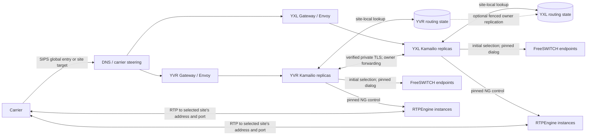

# Stateful SIP routing and multisite availability plan

This is a proposed, gated upgrade to the [current SIP routing architecture](SIP-ROUTING-ARCHITECTURE.md). Track evidence and implementation in the [phased TODO](../TODO.md). No phase in this plan is deployed by this document. A phase is complete only after its acceptance evidence is linked in the tracker.

## Verified repository baseline and limits

The active [AVoIP ApplicationSet](https://github.com/K-FOSS/CoRE-Backplane/blob/main/Apps/Business/AVoIP.yaml) renders this chart through Lovely into `core-prod` for DC1/YXL, Home1/YVR, and a `dc1-k3s` spoke. It injects site identities, DIDs, and distinct media addresses and port ranges. DC1 and Home1 enable FreeSWITCH and Asterisk; the spoke does not. The [Ingress ApplicationSet](https://github.com/K-FOSS/CoRE-Backplane/blob/main/Apps/Network/Ingress.yaml) owns the site Gateways. The chart alone is not the deployed values layer.

Committed repository configuration shows one Kamailio and one RTPEngine replica by default, one FreeSWITCH replica, a single FreeSWITCH TLS Service as Kamailio's backend, and a single RTPEngine NG control Service. Kamailio uses `tm` and `rr`, but does not load `dispatcher`, `dialog`, DMQ, or `topos`; its script has one static backend destination and no persisted call assignment. RTPEngine is configured with a site-local Valkey cluster and primary-aware proxy; this does not establish live media takeover. Public SIP uses site-specific SIPS identities by default. The opt-in `sip.resolvemy.host` K8GB path is disabled in chart defaults. These are manifest findings, not an inventory of observed pods or a successful call. Uncommitted local routing edits were present during this review; they are not treated as deployed or accepted evidence.

The existing [SIP identity investigation](SIP-IDENTITY.md) records an approximately 32-second `ACK Timeout`; the [reply regression test](../tests/README.md) exercises a local Kamailio fixture, not carrier delivery or live RTP. The fax DID is separate from the voice DID in the current dialplan. Phase 0 must establish live behavior before scaling the route.

## Target path and owner contract

At initial call setup, assign an immutable owning site, a winning FreeSWITCH endpoint, and an RTPEngine control/media owner. The initial INVITE, early dialog, answered dialog, re-INVITE, ACK, BYE, and cleanup must use that assignment. A retry may choose another backend only before an answer or downstream side effect, under an explicit transaction rule. A different ingress site forwards a supported in-dialog request to the still-live owner over verified private TLS; it does not become the call owner by DNS selection. Each site needs a local new-call path during an intersite partition. The design must choose whether an opaque, authenticated route token or an authoritative owner registry provides cross-replica recovery; using both as independent authorities risks conflicting assignments.

`sip.resolvemy.host` is the proposed global **entry** identity. The configurable cluster-scoped `sip.<cluster>.<datacenter>.<region>.resolvemy.host` identities remain addressable and identify the owning site. The exact public Contact and Record-Route contract, including how an in-dialog request that arrives at the other site discovers the owner, is an open decision. DNS steering alone cannot provide dialog affinity. Preserve carrier authorization and private server identity checks at both sites; the intersite hop must authenticate the peer and verify the expected private TLS name. Preserve the existing media configuration and dedicated fax DID while introducing routing changes. No timeout increase, weaker TLS validation, or direct-media bypass is an accepted fix.

## State boundaries

| State | Current boundary | Proposed treatment | Recovery limit / proof needed |
| --- | --- | --- | --- |
| SIP transactions, including negative-response ACK and CANCEL | Local to Kamailio `tm` process | Keep local; select a transaction-consistent retry path | A restarted proxy loses in-flight transaction state. Retransmission and peer retry behavior need tests. |
| Dialog route set and topology records | Record-Route and rewritten Contact in messages; no shared `topos` store | Evaluate [topos](https://www.kamailio.org/docs/modules/stable/modules/topos.html) storage, [dialog](https://www.kamailio.org/docs/modules/stable/modules/dialog.html) tracking, and DMQ for their *documented* fields; use identical keys/configuration on replicas | A route set can help a new proxy route, but topology keys, early dialogs, forks, and race timing need proof. Dialog DMQ alone is not an assignment authority. |
| Custom owner/site/backend/media assignment | Static site and backend now; no per-call record | Choose one authoritative token or registry. Persist only fields that supported modules do not carry, with expiry and cleanup | Another replica must recover the exact winning endpoint and media owner before forwarding an answered dialog. |
| TCP/TLS and Envoy connections | Local to each Envoy and Kamailio process | Peers reconnect; test SNI, certificate and PROXY protocol behavior on a new connection | Neither routing storage nor DMQ moves a connection. |
| FreeSWITCH application/channel sessions | Local to one FreeSWITCH process | Pin the live call to that endpoint; evaluate service-specific recovery in Phase 5 | Voice, IVR and fax sessions do not migrate with SIP state. |
| RTPEngine media sessions, ports and public address | Local packet processing with configured Valkey persistence; one control Service and one site public media Service | Pin NG commands and RTP delivery to an individually addressable media owner. Evaluate restoration/takeover separately | Shared keys alone do not transfer socket/port ownership or peer RTP destination. |

The current [PostgreSQL ApplicationSet](https://github.com/K-FOSS/CoRE-Backplane/blob/main/Apps/Storage/PSQL.yaml) marks Home1 writable and DC1 standby; promotion and partition writes have not been proven for this use. The [storage ApplicationSet](https://github.com/K-FOSS/CoRE-Backplane/blob/main/Apps/Storage/Base.yaml) describes site storage/backup inputs, not a cross-site SIP state guarantee. A new application data identity must follow the [User XRD](https://github.com/K-FOSS/CoRE-Backplane/blob/main/Operations/SSO/User/templates/User/UserResourceDef.yaml) and its actual Composition behavior. The existing RTPEngine Valkey store must not silently become the SIP owner registry. Validate required Redis commands, TLS/ACL behavior, keyspace notifications, persistence and client reconnects against the selected Valkey or site-local Dragonfly implementation before relying on it.

The implementation must be checked against the upstream [Kamailio documentation](https://www.kamailio.org/docs/), [FreeSWITCH documentation](https://developer.signalwire.com/freeswitch/), [RTPEngine source and documentation](https://github.com/sipwise/rtpengine), [Envoy Gateway TLS routing documentation](https://gateway.envoyproxy.io/docs/tasks/traffic/tls-passthrough/), and [K8GB documentation](https://www.k8gb.io/). Their presence in a proposed path does not prove a feature works with the pinned images or site configuration.

## Failure contract

This matrix states the **proposed minimum** after Phases 1–4 pass. The present stack has no proven call continuity; Phase 0 records it. “Existing” assumes the FreeSWITCH and media owner remain live unless that row says otherwise. Phase 5 may improve outcomes only with separate proof.

| Failure | Existing calls | New calls |
| --- | --- | --- |
| Kamailio restart or replica loss | An in-flight transaction/TLS connection is lost. A peer retry or later request can reach another replica and recover owner routing only after Phase 3 proof. Media may continue independently. | Healthy replica accepts calls if Gateway and assignment store/path work. |
| Envoy restart | Its TCP/TLS streams close; peer reconnect and retransmission behavior determines signaling continuity. It does not change the call owner. | Another healthy ingress instance accepts calls after usable SIP health recovers. |
| FreeSWITCH endpoint loss | Its application session is lost; signaling metadata cannot rebuild voice, IVR, or fax. End or report the call cleanly. | Health selection excludes it; retry only a safely uncommitted initial attempt. |
| RTPEngine instance loss | Expect media interruption/loss until Phase 5 demonstrates state, public IP/port delivery and fenced takeover. Do not reassign NG commands blindly. | Select another healthy instance with valid advertised address and port ownership. |
| Routing storage outage | Existing calls use recoverable token/locally cached assignment only if that mode is proved safe; otherwise reject requests needing missing state. Keep cleanup retryable. | Fail closed when a durable assignment cannot be created; local-only mode requires an explicit, tested policy. |
| Intersite partition | Calls remain with their owning site; cross-site arrivals cannot reach the owner and fail clearly. Prevent ownership changes or two writers for one dialog. | Each site accepts site-local calls using local state and media. Global DNS/carrier steering may be stale; health must distinguish reachability. |
| Complete site loss | Calls owned by that site lose its FreeSWITCH and media sessions; another ingress can identify failure, but continuity is unproven and out of Phase 4 scope. | Surviving site accepts new calls after steering, with its own backend/media path. |

## Phases, migration and rollback

The [TODO](../TODO.md) carries detailed tasks, dependencies, acceptance and status. Promote one site or a bounded carrier test path at a time; compare both site renders and live call evidence before widening traffic. Preserve site-local routing and the dedicated fax DID throughout.

| Phase | Migration gate | Rollback outline |
| --- | --- | --- |
| 0 — Baseline | Capture ACK, public serialized headers, sockets, SDP, versions/endpoints, 60-second voice and separate fax evidence. | Diagnostics are temporary; restore prior logging levels. No routing change. |
| 1 — Routing correction | Add regression fixtures and verify both directions over current single backend. Roll out one site, then the other, only after a live voice/fax check. | Revert the scoped routing commit through GitOps; preserve captures and current carrier ACL/TLS/media settings. Drain test calls before reversal if route-set format changed. |
| 2 — Site-local balancing | Introduce individually addressable backends and media instances behind a disabled or single-target selection; prove pinning, health and draining before raising replica counts. | Stop new pool assignments, drain calls on selected endpoints, return to one known endpoint. Keep its Service/address and state until dialogs expire. Do not remove media ports in use. |
| 3 — Shared routing state | Shadow-write/read and compare assignments first; validate storage compatibility and cross-replica routing, then require it for a bounded call path. | Disable new state-dependent assignments, continue honoring old route tokens/records through retention, and drain before removing keys/module configuration. Never make in-flight dialogs undecodable. |
| 4 — Multisite ingress | Establish verified private TLS and owner forwarding; test both sites independently, then enable global entry or carrier steering for bounded traffic. | Restore site-specific new-call targets and disable global steering; retain old owner forwarding and identities until existing dialogs expire. DNS rollback does not move live calls. |
| 5 — Active-call recovery research | Use a separate fault-injection test path for media and FreeSWITCH takeover; enable only a proved mechanism with fencing and measured interruption. | Disable new takeovers, restore the previously proven owner-pinning path, and drain sessions before changing public media ownership. |

For every runtime phase, review the [AVoIP ApplicationSet](https://github.com/K-FOSS/CoRE-Backplane/blob/main/Apps/Business/AVoIP.yaml) Lovely merge, both site renders, sync hooks and targeted Argo CD applications before a later deployment request. A rollback is a reviewed GitOps change, with preserved state and identities until the longest supported dialog retention expires; avoid deleting a store or Service that still owns calls.

## Validation plan

1. Render both site value layers through the Lovely composition; run Helm lint and parser checks. Inspect exact Service selectors, endpoint identity, TLS names, Gateway routes, PROXY settings, public Contact/Record-Route, SDP address and all state references. Record deployed versions and live endpoints separately from intended manifests.
2. Use the [SIP test harness](../tests/README.md) plus packet/Homer traces keyed by Call-ID, tags and CSeq. Add positive and negative INVITE responses, 2xx and non-2xx ACK, CANCEL, both BYE directions, re-INVITE, duplicate replies, malformed routes, unauthorized sources, and socket/SNI selection. Compare serialized outbound bytes, not only script variables.
3. Place a voice call with bidirectional RTP for more than 60 seconds, observed ACK on both hops and clean BYE/200. Run the dedicated fax DID separately and record its SIP, T.38/G.711, TIFF and completion outcome. A short fax success does not satisfy the voice gate.
4. Under bounded test traffic, change backend pool membership, drain endpoints, restart one Kamailio/Envoy, fail one FreeSWITCH and one RTPEngine, interrupt storage, partition sites and fail a complete site. For each, record existing/new call outcome, retry count, selected owners, RTP packet path, interruption and cleanup. Avoid replaying answered calls.
5. For Phase 5, verify required Redis keyspace events and exact restoration commands, public IP/port takeover and fencing, FreeSWITCH voice/IVR/fax behavior, and carrier reconnect behavior. Record unsupported session types explicitly.

## Open decisions and assumptions requiring proof

- Which public Contact/Record-Route encoding keeps a site owner discoverable when `sip.resolvemy.host` resolves to the other site? Decide token versus authoritative registry and key/version rotation before global advertising.
- Which [topos](https://www.kamailio.org/docs/modules/stable/modules/topos.html) storage backend and [dialog/DMQ](https://www.kamailio.org/docs/modules/stable/modules/dialog.html) fields work with the pinned Kamailio version and selected Valkey/Dragonfly commands? Define early-dialog, fork, retransmission, TTL, cleanup and visibility semantics.
- Which per-instance FreeSWITCH and RTPEngine endpoint discovery mechanism, health/capacity signal, drain policy and initial retry rule preserves the winning endpoint? A Kubernetes Service VIP alone cannot identify its chosen pod later.
- How are public RTP IP and UDP ports delivered to the chosen RTPEngine, and what fencing prevents two instances claiming the same media session? Existing site media values remain the starting constraint.
- Can each site create durable local assignments during an intersite partition without split brain? Prove PostgreSQL promotion/write behavior or choose another authority with explicit site ownership and reconciliation.
- Which usable SIP/media health signals drive K8GB DNS, carrier failover destinations, or BGP anycast? Evaluate those mechanisms separately, including stale DNS, withdrawal and connection draining. Their deployment and carrier behavior are unverified.
- Which verified private TLS names/certificates and network policy support intersite forwarding, and how are source authorization and PROXY protocol preserved across the boundary?
- Which FreeSWITCH voice, IVR and fax sessions, if any, and which RTPEngine sessions can actually resume after endpoint or complete-site loss? No such recovery is assumed.
