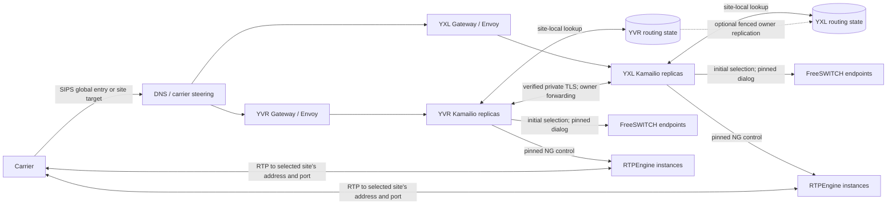
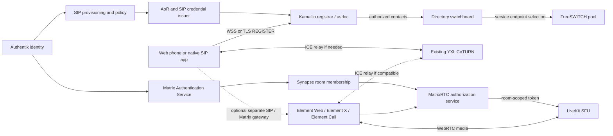
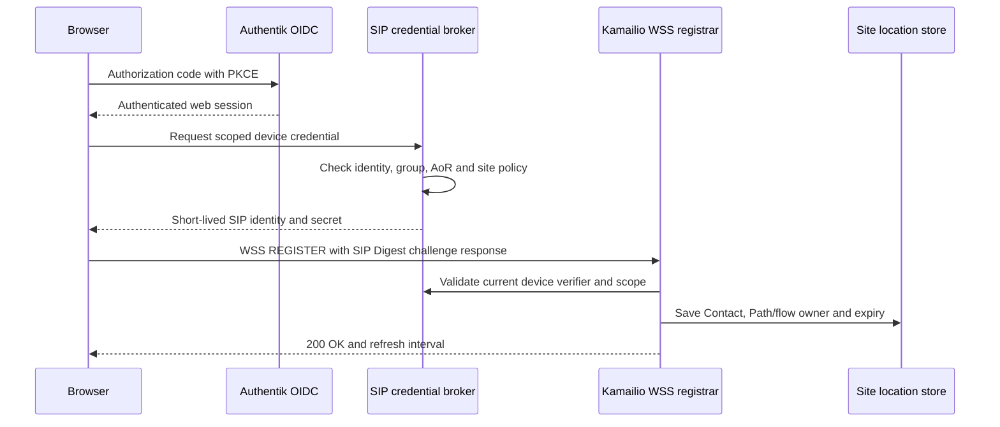

# Stateful SIP routing and multisite availability plan

This is a proposed, gated upgrade to the [current SIP routing architecture](SIP-ROUTING-ARCHITECTURE.md), with related SIP/WebRTC, MatrixRTC and native calling tracks. Track evidence and implementation in the [phased TODO](../TODO.md). No phase in this plan is deployed by this document. A phase is complete only after its acceptance evidence is linked in the tracker.

## Verified repository baseline and limits

The active [AVoIP ApplicationSet](https://github.com/K-FOSS/CoRE-Backplane/blob/main/Apps/Business/AVoIP.yaml) renders this chart through Lovely into `core-prod` for DC1/YXL, Home1/YVR, and a `dc1-k3s` spoke. It injects site identities, DIDs, and distinct media addresses and port ranges. DC1 and Home1 enable FreeSWITCH and Asterisk; the spoke does not. The [Ingress ApplicationSet](https://github.com/K-FOSS/CoRE-Backplane/blob/main/Apps/Network/Ingress.yaml) owns the site Gateways. The chart alone is not the deployed values layer.

Committed repository configuration shows one Kamailio and one RTPEngine replica by default, one FreeSWITCH replica, a single FreeSWITCH TLS Service as Kamailio's backend, and a single RTPEngine NG control Service. Kamailio uses `tm` and `rr`, but does not load `dispatcher`, `dialog`, DMQ, or `topos`; its script has one static backend destination and no persisted call assignment. RTPEngine is configured with a site-local Valkey cluster and primary-aware proxy; this does not establish live media takeover. Public SIP uses site-specific SIPS identities by default. The opt-in `sip.resolvemy.host` K8GB path is disabled in chart defaults. These are manifest findings, not an inventory of observed pods or a successful call. Uncommitted local routing edits were present during this review; they are not treated as deployed or accepted evidence.

The [SIP identity investigation](SIP-IDENTITY.md) records the prior approximately 32-second `ACK Timeout` as reported resolved on 2026-10-07; retained Call-ID-correlated ACK, duration, and clean termination evidence is still required. The [reply regression test](../tests/README.md) exercises a local Kamailio fixture, not carrier delivery or live RTP. The fax DID is separate from the voice DID in the current dialplan. Phase 0 must establish live behavior before scaling the route.

The committed chart has Asterisk and FreeSWITCH `User.mylogin.space` service claims, a FreeSWITCH LDAP mapping and loopback-only Event Socket. It has no general registrar, WSS route, dynamic user dialplan, SIP credential issuer or web phone. The [Matrix chart](https://github.com/K-FOSS/CoRE-Business/tree/main/Social/Matrix) is separately owned by the [Matrix ApplicationSet](https://github.com/K-FOSS/CoRE-Backplane/blob/main/Apps/Business/Social/Matrix.yaml): its values pin Synapse `v1.161.0`, MAS `1.20.0` and Element Web `v1.12.29`. It configures MAS to delegate to Authentik OIDC and advertises TURN, but contains no Element Call, MatrixRTC transport, LiveKit or RTC authorization service. Deployed images, native Element X versions and live capabilities still require inventory.

## Target path and owner contract

The RTC paths share an identity source and may reuse TURN, but retain separate
authorization and signaling:

At initial call setup, assign an immutable owning site, a winning FreeSWITCH endpoint, and an RTPEngine control/media owner. The initial INVITE, early dialog, answered dialog, re-INVITE, ACK, BYE, and cleanup must use that assignment. A retry may choose another backend only before an answer or downstream side effect, under an explicit transaction rule. A different ingress site forwards a supported in-dialog request to the still-live owner over verified private TLS; it does not become the call owner by DNS selection. Each site needs a local new-call path during an intersite partition. The design must choose whether an opaque, authenticated route token or an authoritative owner registry provides cross-replica recovery; using both as independent authorities risks conflicting assignments.

`sip.resolvemy.host` is the proposed global **entry** identity. The configurable cluster-scoped `sip.<cluster>.<datacenter>.<region>.resolvemy.host` identities remain addressable and identify the owning site. The exact public Contact and Record-Route contract, including how an in-dialog request that arrives at the other site discovers the owner, is an open decision. DNS steering alone cannot provide dialog affinity. Preserve carrier authorization and private server identity checks at both sites; the intersite hop must authenticate the peer and verify the expected private TLS name. Preserve the existing media configuration and dedicated fax DID while introducing routing changes. No timeout increase, weaker TLS validation, or direct-media bypass is an accepted fix.

## State boundaries

| State | Current boundary | Proposed treatment | Recovery limit / proof needed |
| --- | --- | --- | --- |
| SIP transactions, including negative-response ACK and CANCEL | Local to Kamailio `tm` process | Keep local; select a transaction-consistent retry path | A restarted proxy loses in-flight transaction state. Retransmission and peer retry behavior need tests. |
| Dialog route set and topology records | Record-Route and rewritten Contact in messages; no shared `topos` store | Evaluate [topos](https://www.kamailio.org/docs/modules/stable/modules/topos.html) storage, [dialog](https://www.kamailio.org/docs/modules/stable/modules/dialog.html) tracking, and DMQ for their *documented* fields; use identical keys/configuration on replicas | A route set can help a new proxy route, but topology keys, early dialogs, forks, and race timing need proof. Dialog DMQ alone is not an assignment authority. |
| Custom owner/site/backend/media assignment | Static site and backend now; no per-call record | Choose one authoritative token or registry. Persist only fields that supported modules do not carry, with expiry and cleanup | Another replica must recover the exact winning endpoint and media owner before forwarding an answered dialog. |
| TCP/TLS and Envoy connections | Local to each Envoy and Kamailio process | Peers reconnect; test SNI, certificate and PROXY protocol behavior on a new connection | Neither routing storage nor DMQ moves a connection. |
| FreeSWITCH application/channel sessions | Local to one FreeSWITCH process | Pin the live call to that endpoint; evaluate service-specific recovery in Phase 5 | Voice, IVR and fax sessions do not migrate with SIP state. |
| RTPEngine media sessions, ports and public address | Local packet processing with configured Valkey persistence; one control Service and one site public media Service | Pin NG commands and RTP delivery to an individually addressable media owner. Evaluate restoration/takeover separately | Shared keys alone do not transfer socket/port ownership or peer RTP destination. |

The current [PostgreSQL ApplicationSet](https://github.com/K-FOSS/CoRE-Backplane/blob/main/Apps/Storage/PSQL.yaml) marks Home1 writable and DC1 standby; promotion and partition writes have not been proven for this use. The [storage ApplicationSet](https://github.com/K-FOSS/CoRE-Backplane/blob/main/Apps/Storage/Base.yaml) describes site storage/backup inputs, not a cross-site SIP state guarantee. A new application data identity must follow the [User XRD](https://github.com/K-FOSS/CoRE-Backplane/blob/main/Operations/SSO/User/templates/User/UserResourceDef.yaml) and its actual Composition behavior. The existing RTPEngine Valkey store must not silently become the SIP owner registry. Validate required Redis commands, TLS/ACL behavior, keyspace notifications, persistence and client reconnects against the selected Valkey or site-local Dragonfly implementation before relying on it.

The implementation must be checked against the upstream [Kamailio documentation](https://www.kamailio.org/docs/), [FreeSWITCH documentation](https://developer.signalwire.com/freeswitch/), [RTPEngine source and documentation](https://github.com/sipwise/rtpengine), [Envoy Gateway TLS routing documentation](https://gateway.envoyproxy.io/docs/tasks/traffic/tls-passthrough/), and [K8GB documentation](https://www.k8gb.io/). Their presence in a proposed path does not prove a feature works with the pinned images or site configuration.

## Identity, SIP address and directory policy (Phase 6)

Use [Authentik's OIDC provider](https://docs.goauthentik.io/add-secure-apps/providers/oauth2) as the proposed browser identity source and its [LDAP provider](https://docs.goauthentik.io/add-secure-apps/providers/ldap/) for directory reads where required. The immutable Authentik subject or a provisioned immutable ID is the person or service key. A SIP address of record (AoR), extension, display name, group membership and site/tenant scope are separate, changeable attributes; a reassigned extension must never transfer old registrations, credentials or call permissions to the new owner. A directory reconciler should produce a versioned, access-controlled identity and route-policy view for each site. Human account, browser session, device, automation account and carrier trunk are distinct principals. The carrier remains source-authorized on its existing ingress and cannot REGISTER.

| Principal/client | Proposed login and SIP credential | Registration and privilege boundary |
| --- | --- | --- |
| Browser web phone | OIDC authorization-code/PKCE to the web application, then a scoped short-lived random SIP/device secret issued for that session; client receives only its own secret | SIP Digest verifier or a separately proven token-aware SIP authentication path; WSS and device/AoR scope; no primary directory password in browser storage. |
| Native SIP device | Dedicated revocable device secret and SIP Digest, provisioned through the identity lifecycle; mTLS only when device and proxy support and verify it | One device ID, allowed AoR, site, contact limit and outbound policy. |
| Human with several devices | One immutable identity and AoR with several separately revocable device credentials | Per-device contacts and call/concurrency limits; no shared user password. |
| Automation/service account | Owner, purpose, expiry and least-privilege scoped secret or verified client certificate | Explicit allowed source, destination classes, concurrent-call limit and no default outbound carrier permission. |
| Carrier trunk | Existing Flowroute source restriction and verified TLS path | Separate trunk entry; no user registration or directory privilege. |
| Matrix/Element client | Existing MAS delegation to Authentik OIDC and Matrix room authorization | Matrix access and RTC tokens are separate from SIP credentials; no implicit AoR or PSTN permission. |

[Kamailio SIP Digest authentication](https://www.kamailio.org/docs/modules/stable/modules/auth_db.html) needs a verifier for the selected realm (or a tested implementation that can validate the full challenge); an OIDC token, LDAP bind or [Authentik RADIUS](https://docs.goauthentik.io/add-secure-apps/providers/radius/) password result is not automatically such a verifier. Prefer a credential broker that issues random per-device SIP secrets after current identity and policy checks, stores only the server-side verifier, and returns the secret once over an authenticated session. Define realm, algorithm, challenge replay protection, rate limits and credential exposure limits against the selected client. LDAP/RADIUS checks are candidates only where the SIP authentication module demonstrably supports them. The [Backplane User XRD](https://github.com/K-FOSS/CoRE-Backplane/blob/main/Operations/SSO/User/templates/User/UserResourceDef.yaml) accepts an `AVoIP` field but does not itself define SIP verifier provisioning; inspect the Composition before using that claim for this lifecycle.

Credential expiry prevents new registration refreshes. Suspension, deletion, owner transfer or rotation must revoke the credential at every site, remove or invalidate its contacts, deny new calls and document whether live calls are terminated immediately or allowed to finish under an audited exception. Browser logout clears the issued secret and attempts deregistration, but server-side expiry/revocation remains authoritative. Cache invalidation, clock skew, existing registrations, offline sites and failure of the credential issuer need explicit tests. Mask secrets in logs and never place them in chart values.

## Registrar, connection and media ownership (Phase 7)

Evaluate [Kamailio registrar](https://www.kamailio.org/docs/modules/stable/modules/registrar.html), [usrloc](https://www.kamailio.org/docs/modules/stable/modules/usrloc.html), [Path](https://www.kamailio.org/docs/modules/stable/modules/path.html), [outbound](https://www.kamailio.org/docs/modules/stable/modules/outbound.html) and [WebSocket](https://www.kamailio.org/docs/modules/stable/modules/websocket.html) at the pinned version. A site-qualified AoR resolves to zero or more authorized, expiring device Contacts; it does not name a FreeSWITCH pod. Dispatcher discovers and selects FreeSWITCH infrastructure endpoints separately. Define contact count, q/parallel ringing, refresh, deregistration, stale cleanup, NAT/received address, Path, outbound flow token, transport affinity and SIP transaction behavior.

The location record may be shared among Kamailio replicas, while a WSS/TLS socket remains on the accepting replica. A request received on another replica must follow a verified Path/flow route to that still-live connection owner; a database row alone cannot send on a dead socket. After proxy, Envoy or site loss, the client reconnects and re-registers, and stale flow records expire or are removed. Site-local registration writes are required if both sites must keep accepting local calls during an intersite partition. The current [PostgreSQL ApplicationSet](https://github.com/K-FOSS/CoRE-Backplane/blob/main/Apps/Storage/PSQL.yaml) has Home1 writable and DC1 standby, so a single cross-site writable `usrloc` database is only a **single-site pilot candidate**, not proof of independent site operation. Choose and test a site-local write authority, site-qualified AoRs and reconciliation rules before Phase 4 availability claims extend to registered users. Restrict REGISTER to dedicated user/device WSS/TLS entry points with authorization, rate limits and origin policy; the carrier route continues to reject it.

This sequence is a design, not an implemented credential protocol. Define whether the broker exposes a verifier lookup, a bounded replicated verifier store or another proven SIP module interface. Test revoked credentials against new REGISTER, refresh and existing contacts.

## Existing TURN dependency and consumer integration

The [NATPuncher ApplicationSet](https://github.com/K-FOSS/CoRE-Backplane/blob/main/Apps/Network/NATPuncher.yaml) enables CoTURN in DC1/YXL and disables it in Home1/YVR. Its [chart configuration](https://github.com/K-FOSS/CoRE-Backplane/blob/main/Network/NATPuncher/templates/common.yaml) advertises `66.165.222.101` as the external address, `nat.mylogin.space` as server name/realm, TLS material from `myloginspace-default-certificates`, UDP/TCP 3478, TCP/UDP 5349 Service ports and CoTURN relay range 15000–16000. The Service template iterates to *below* 16000 while CoTURN's `max-port` is 16000; check effective exposure and allocations at the upper boundary. These are desired-state settings; the user reports CoTURN works, but this review did not make an external allocation test. YVR TURN availability and cross-site reachability are not established by this ApplicationSet.

The [NATPuncher credential generator](https://github.com/K-FOSS/CoRE-Backplane/blob/main/Network/NATPuncher/templates/TurnAuthSecret.yaml) creates its REST/shared secret once; the [PushSecret](https://github.com/K-FOSS/CoRE-Backplane/blob/main/Network/NATPuncher/templates/TurnAuthPushSecret.yaml) publishes it to a site Vault path. The [Matrix chart](https://github.com/K-FOSS/CoRE-Business/blob/main/Social/Matrix/values.yaml) consumes the YXL path and Synapse advertises `turn:nat.mylogin.space:3478` over UDP/TCP. Rotation is not automatic: define a coordinated overlap/cutover and verify existing allocation behavior. NATPuncher writes allocation statistics to site-local Dragonfly database 154; chart probes are disabled, so service readiness alone is not an allocation test. Inventory allocation failures, bandwidth, port pressure, certificate/DNS validity, client transport fallback and per-site failure behavior before adding consumers.

The SIP web phone can request short-lived CoTURN REST credentials from a consumer-scoped issuer if tested with that client. Matrix Synapse already uses this mechanism for its own advertised TURN credentials. A LiveKit SFU may instead need its own TURN integration or different client credential path; confirm its current supported configuration before linking it to CoTURN. Keep credential lifetime, audience, issuance rate, quota and revocation specific to SIP, Matrix and SFU. Shared TURN media reachability is not shared signaling or a SIP/Matrix bridge.

## SIP/WebRTC web phone and native SIP client (Phase 8)

Evaluate maintained [SIP.js](https://github.com/onsip/SIP.js) and [JsSIP](https://github.com/versatica/JsSIP) first. [SIP.js SimpleUser](https://sipjs.com/guides/simple-user/) omits transfer and supports only one call, so its full API must be evaluated for the required operator controls; [JsSIP documentation](https://jssip.net/documentation/) describes SIP over WebSocket and WebRTC, but browser/iPad behavior still requires direct testing. Neither library supplies OIDC provisioning, a complete phone UI or background push by itself. [Linphone](https://www.linphone.org/en/download/) is a native SIP client candidate for iOS/Android; its [FAQ](https://www.linphone.org/en/faq/) says mobile push for third-party SIP accounts is not available by default, so its push service and CallKit path need a specific integration decision. Select a maintained native SIP client separately if locked-device incoming SIP calls are required.

A dedicated HTTPS/WSS route with valid certificate, WebSocket upgrade, origin checks and authenticated SIP registration is needed; the present SIPS `TLSRoute` is not a browser WSS endpoint. Reuse existing CoTURN after checking ICE/STUN/TURN credentials and UDP/TCP/TLS fallback. Prove [RTPEngine's](https://github.com/sipwise/rtpengine) DTLS-SRTP, ICE, SRTP/RTP bridging and codec behavior with the pinned build and FreeSWITCH; add transcoding only for a measured mismatch. Test calls to another browser, a registered SIP device and Flowroute separately, with DTMF, mute, hold, attended/blind transfer, microphone permission, device choice, audio output selection, reconnect, iPad Safari and network changes. Browser output-device selection is browser dependent; see [MediaDevices output selection](https://developer.mozilla.org/en-US/docs/Web/API/MediaDevices/selectAudioOutput). A suspended browser tab is not a reliable incoming-call receiver. A native client needs its own push and OS calling support.

## Directory-driven switchboard (Phase 9)

The directory reconciler publishes authorized identities, extension aliases, group membership, service destinations and visibility rules; the registrar supplies current device contacts. A stable AoR is looked up only after caller and destination policy allow it. Declare routing policy for local extensions, ring groups, queues, voicemail, schedules and IVR/AI services; generate no per-user dialplan stanza. Keep dispatcher selection of FreeSWITCH infrastructure separate from registrar lookup of user devices. Preserve the current voice-to-Asterisk and dedicated fax DID paths until equivalent behavior is accepted; directory provisioning must never turn on fax detection for the main voice DID.

SIP presence/BLF is a subscription and publication feature with its own authorization and stale-state rules. Queue position, agent status, answered calls and transfers need authoritative FreeSWITCH/Asterisk events and reconciliation, not a presence lamp alone. The current FreeSWITCH Event Socket binds only to loopback; an operator API must use a narrowly authenticated integration, not expose that socket publicly. Set role-scoped operator actions, audit trails, tenant/site visibility, rate limits, concurrent devices/calls, destination classes, outbound trunk permissions and fraud thresholds. Unknown identities, stale groups and absent policy fail closed. Service accounts require explicit allowed destinations and time-bounded ownership.

| Shortlist | Why evaluate | Required proof |
| --- | --- | --- |
| [FusionPBX Operator Panel](https://docs.fusionpbx.com/en/latest/applications/operator_panel.html) and [Call Center](https://docs.fusionpbx.com/en/latest/applications.html) | Existing FreeSWITCH-based operator, queue and transfer UI | Integration with this chart's directory, MAS/Authentik identity, site scoping and nondefault FreeSWITCH topology; avoid a competing provisioning authority. |
| [FreeSWITCH `mod_callcenter`](https://developer.signalwire.com/freeswitch/applications/call-queues/) plus a constrained [Event Socket](https://developer.signalwire.com/freeswitch/integration/event-socket/) adapter | Direct control of current call engine and authoritative call/queue events | State persistence, multi-replica event aggregation, API permissions and operator UI effort. |
| [FOP2](https://www.fop2.com/docs/FOP2_User_Guide.pdf) | Established Asterisk operator-console candidate | Asterisk-only control plane fit, license, directory synchronization and inability to manage FreeSWITCH-owned calls without an explicit bridge. |

Migrate one test extension: shadow-compare directory and current declarative route decision, route it dynamically only after contact and permission checks pass, then expand to a ring group and queue. On rollback, stop new dynamic assignments, drain active calls/queues, and restore the prior declarative route without reassigning old AoRs or exposing fax to the main line. No operator software has been selected.

## MatrixRTC / Element Call (Phase 10)

The current [Element Call self-hosting guide](https://github.com/element-hq/element-call/blob/main/docs/self_hosting.md) describes a [LiveKit](https://docs.livekit.io/home/self-hosting/deployment/) SFU plus [MatrixRTC authorization service](https://github.com/element-hq/lk-jwt-service) and a compatible homeserver advertising transports. Its [client architecture](https://github.com/element-hq/element-call) discovers MatrixRTC transports through the client API; the auth service checks Matrix membership and grants room-scoped LiveKit access. Verify required Synapse MSC4140 delayed events, transport discovery (MSC4519), authorization behavior and exact pinned client compatibility before proposing manifests. The existing MAS-to-Authentik login remains the Matrix identity path; it does not authorize an SFU join by itself. Inventory whether Element Call should be embedded in Element Web/Element X, hosted separately, or both; no such deployment is configured in this chart today.

Document HTTPS authorization and WSS SFU endpoints, public UDP media and TCP/TLS fallback, SFU advertised address, direct versus TURN-relayed client media and whether the selected LiveKit release can consume the existing CoTURN credential model. The Element Call guide also describes an SFU-specific TURN option; do not assume the shared CoTURN server replaces it. Choose site placement, capacity, room affinity, draining and failover; an established room does not move to another SFU merely because DNS changes. Test room authorization, audio/video, screen sharing, restricted networks and reconnects using actual Element Web and Element X iOS/iPadOS versions. Keep MatrixRTC independently usable without SIP interop.

## Native incoming calls and optional interoperability (Phases 11–12)

[Apple CallKit](https://developer.apple.com/documentation/CallKit/CXProvider/reportNewIncomingCall%28with%3Aupdate%3Acompletion%3A%29) presents and coordinates system calls; [PushKit](https://developer.apple.com/documentation/pushkit/responding-to-voip-notifications-from-pushkit) can wake an eligible native VoIP app. [Android ConnectionService](https://developer.android.com/reference/android/telecom/ConnectionService) is the corresponding platform integration to assess. Verify the chosen clients' actual MatrixRTC and SIP support rather than inferring it from OS APIs. Element's [native iOS call component](https://github.com/element-hq/element-call-ios/blob/main/CHANGES.md) describes host CallKit integration, but the deployed Element X build and SIP use are unverified. Inventory APNs/FCM and any Matrix push gateway, app wake-up, audio session, Bluetooth route, interruption and competing-call handling. Test locked-device answer/decline, missed calls and network changes. Server settings cannot give a browser tab or standalone Element Call webpage CallKit support.

SIP-to-Matrix calling is optional Phase 12 and needs an actual supported gateway or bridge. Evaluate identity/AoR to Matrix ID mapping, consent and room membership, SIP versus Matrix signaling and lifecycle translation, media termination/transcoding, encryption boundary, DTMF, transfers and operator permissions. A shared TURN server does not bridge these protocols. Keep MatrixRTC and SIP calling independently testable while evaluating the gateway.

## Failure contract

This matrix states the **proposed minimum** after the relevant phases pass. The present stack has no proven SIP call continuity; Phase 0 records it. “Existing” assumes the FreeSWITCH and media owner remain live unless that row says otherwise. Phase 5 may improve outcomes only with separate proof. MatrixRTC and browser behavior are separate acceptance tracks.

| Failure | Existing calls | New calls |
| --- | --- | --- |
| Kamailio restart or replica loss | An in-flight transaction/TLS/WSS connection is lost. A peer retry or later request can recover owner routing only after Phase 3 proof. A WSS device must reconnect and re-register if its flow owner died. | Healthy replica accepts calls if Gateway, registrar and assignment paths work; stale contacts cannot be treated as reachable. |
| Envoy restart | Its TCP/TLS/WSS streams close; peer reconnect and retransmission behavior determines signaling continuity. It does not change the call owner. | Another healthy ingress instance accepts calls after usable SIP and WSS health recovers. |
| FreeSWITCH endpoint loss | Its application session is lost; signaling metadata cannot rebuild voice, IVR, or fax. End or report the call cleanly. | Health selection excludes it; retry only a safely uncommitted initial attempt. |
| RTPEngine instance loss | Expect media interruption/loss until Phase 5 demonstrates state, public IP/port delivery and fenced takeover. Do not reassign NG commands blindly. | Select another healthy instance with valid advertised address and port ownership. |
| Routing storage outage | Existing calls use recoverable token/locally cached assignment only if that mode is proved safe; otherwise reject requests needing missing state. Keep cleanup retryable. | Fail closed when a durable assignment cannot be created; local-only mode requires an explicit, tested policy. |
| Intersite partition | Calls remain with their owning site; cross-site arrivals cannot reach the owner and fail clearly. Prevent ownership changes or two writers for one dialog. | Each site accepts site-local calls using local state and media. Global DNS/carrier steering may be stale; health must distinguish reachability. |
| Complete site loss | Calls owned by that site lose its FreeSWITCH and media sessions; another ingress can identify failure, but continuity is unproven and out of Phase 4 scope. | Surviving site accepts new calls after steering, with its own backend/media path. |
| Credential issuer or directory outage | Existing registrations/calls follow a bounded cached-policy and revocation rule still to be chosen; do not grant new privileges from stale membership. | Credential issuance fails closed; separately test already-valid credential refresh and emergency/site-local policy. |
| Registrar/location store outage | Existing active WSS connection may stay open but lookup and contact refresh can fail; prove cleanup and recovery. | No new registration or registered-user call when current authorized contact cannot be determined. |
| YXL CoTURN loss or unreachable TURN path | Existing relayed browser/Matrix media may stop; direct paths may continue only if actually negotiated. | Restrictive-network calls fail unless another tested TURN site/transport is available; YVR CoTURN is not configured today. |
| MatrixRTC authorization or LiveKit SFU loss | Existing room media or reconnect may fail; room state and SFU session are separate. No automatic room migration claim. | Joining needs a current room authorization and reachable SFU; reject or retry under a tested room-affinity policy. |
| Home1/YVR Matrix site loss | Current Synapse and MAS are owned by the Home1 [Matrix ApplicationSet](https://github.com/K-FOSS/CoRE-Backplane/blob/main/Apps/Business/Social/Matrix.yaml); room state, auth refresh and calls may become unavailable. Existing SFU media outcome needs testing. | New local Matrix login/room joins have no proven alternate site; SIP site-local new-call independence does not imply MatrixRTC independence. |
| Push gateway or native push failure | Foreground calls may continue; a suspended client may miss incoming presentation. | Locked-device incoming calling is not accepted without successful APNs/FCM delivery and client wake-up tests. |
| Optional SIP/Matrix gateway loss | Native SIP and MatrixRTC calls remain separate; gateway-owned interop calls follow its documented failure policy. | Only cross-protocol calls fail; neither native calling path should depend on the gateway. |

## Phases, migration and rollback

The [TODO](../TODO.md) carries detailed tasks, dependencies, acceptance and status. Promote one site or a bounded carrier test path at a time; compare both site renders and live call evidence before widening traffic. Preserve site-local routing and the dedicated fax DID throughout.

| Phase | Migration gate | Rollback outline |
| --- | --- | --- |
| 0 — Baseline | Capture ACK, public serialized headers, sockets, SDP, versions/endpoints, 60-second voice and separate fax evidence. | Diagnostics are temporary; restore prior logging levels. No routing change. |
| 1 — Routing correction | Add regression fixtures and verify both directions over current single backend. Roll out one site, then the other, only after a live voice/fax check. | Revert the scoped routing commit through GitOps; preserve captures and current carrier ACL/TLS/media settings. Drain test calls before reversal if route-set format changed. |
| 2 — Site-local balancing | Introduce individually addressable backends and media instances behind a disabled or single-target selection; prove pinning, health and draining before raising replica counts. | Stop new pool assignments, drain calls on selected endpoints, return to one known endpoint. Keep its Service/address and state until dialogs expire. Do not remove media ports in use. |
| 3 — Shared routing state | Shadow-write/read and compare assignments first; validate storage compatibility and cross-replica routing, then require it for a bounded call path. | Disable new state-dependent assignments, continue honoring old route tokens/records through retention, and drain before removing keys/module configuration. Never make in-flight dialogs undecodable. |
| 4 — Multisite ingress | Establish verified private TLS and owner forwarding; test both sites independently, then enable global entry or carrier steering for bounded traffic. | Restore site-specific new-call targets and disable global steering; retain old owner forwarding and identities until existing dialogs expire. DNS rollback does not move live calls. |
| 5 — Active-call recovery research | Use a separate fault-injection test path for media and FreeSWITCH takeover; enable only a proved mechanism with fencing and measured interruption. | Disable new takeovers, restore the previously proven owner-pinning path, and drain sessions before changing public media ownership. |
| 6 — Identity/provisioning | Pilot one owned service or test human identity with immutable ID, AoR and dedicated credential; shadow-compare directory policy before routing by it. | Stop issuance and dynamic lookups, revoke pilot secrets and restore previous DID routes; retain audit/identity mapping until cleanup completes. |
| 7 — Registrar/location | Introduce private, restricted REGISTER for one test AoR; prove multi-device expiry and cross-replica lookup/flow behavior before migrating users. | Stop new registration, deregister and let short-lived contacts expire, then restore prior static service route; do not delete a location store with active contacts. |
| 8 — SIP web phone | Enable bounded WSS/HTTPS and existing CoTURN integration for test identities; verify DTLS-SRTP and device/browser behavior. | Disable new web-phone login/registration, revoke issued SIP/TURN credentials, let or terminate active calls per policy, retain conventional SIP/voice and fax routes. |
| 9 — Directory switchboard | Shadow-evaluate directory lookup and policy, then route one test extension/ring group before queues and operator controls. | Remove new dynamic route entry, drain active calls/queues, restore previous declarative route; retain event/audit state until reconciled. |
| 10 — MatrixRTC | Validate Synapse/MAS/Element compatibility and existing TURN first; add transport discovery, RTC authorization and SFU for a test room. | Stop new room focus selection, preserve existing room sessions until drained, remove discovery only after clients no longer target it; preserve existing Matrix login/chat. |
| 11 — Native incoming calls | Test chosen native client and push path on limited devices; enable CallKit/Android Telecom only for proven client builds. | Disable pilot incoming-call integration and push mapping; existing Matrix/SIP foreground calls and login continue under their prior paths. |
| 12 — Optional SIP/Matrix gateway | Introduce a separate gateway and consent policy for pilot identities/rooms, without changing either native call path. | Stop new bridged calls and drain gateway sessions; remove only gateway routes/tokens, leaving SIP and MatrixRTC independent. |

For every runtime phase, review the [AVoIP ApplicationSet](https://github.com/K-FOSS/CoRE-Backplane/blob/main/Apps/Business/AVoIP.yaml) Lovely merge, both site renders, sync hooks and targeted Argo CD applications before a later deployment request. MatrixRTC changes also need the [Matrix ApplicationSet](https://github.com/K-FOSS/CoRE-Backplane/blob/main/Apps/Business/Social/Matrix.yaml); TURN integration must inspect the existing [NATPuncher ApplicationSet](https://github.com/K-FOSS/CoRE-Backplane/blob/main/Apps/Network/NATPuncher.yaml). A rollback is a reviewed GitOps change, with preserved state and identities until the longest supported dialog, registration or room retention expires; avoid deleting a store or Service that still owns sessions.

## Validation plan

1. Render both site value layers through the Lovely composition; run Helm lint and parser checks. Inspect exact Service selectors, endpoint identity, TLS names, Gateway routes, PROXY settings, public Contact/Record-Route, SDP address and all state references. Record deployed versions and live endpoints separately from intended manifests.
2. Use the [SIP test harness](../tests/README.md) plus packet/Homer traces keyed by Call-ID, tags and CSeq. Add positive and negative INVITE responses, 2xx and non-2xx ACK, CANCEL, both BYE directions, re-INVITE, duplicate replies, malformed routes, unauthorized sources, and socket/SNI selection. Compare serialized outbound bytes, not only script variables.
3. Place a voice call with bidirectional RTP for more than 60 seconds, observed ACK on both hops and clean BYE/200. Run the dedicated fax DID separately and record its SIP, T.38/G.711, TIFF and completion outcome. A short fax success does not satisfy the voice gate.
4. Under bounded test traffic, change backend pool membership, drain endpoints, restart one Kamailio/Envoy, fail one FreeSWITCH and one RTPEngine, interrupt storage, partition sites and fail a complete site. For each, record existing/new call outcome, retry count, selected owners, RTP packet path, interruption and cleanup. Avoid replaying answered calls.
5. For Phase 5, verify required Redis keyspace events and exact restoration commands, public IP/port takeover and fencing, FreeSWITCH voice/IVR/fax behavior, and carrier reconnect behavior. Record unsupported session types explicitly.
6. For Phases 6–9, create, suspend, rotate and delete a pilot identity and service account. Verify AoR/extension reassignment, group and outbound policy, simultaneous device/call limits, denied carrier REGISTER, Digest challenge, multiple contacts, stale-flow cleanup, WSS reconnection and cross-replica delivery. Test browser login without primary password storage; test iPad Safari, microphone/output choice and browser suspension as a documented limitation. Repeat browser-to-browser, SIP-device and Flowroute calls with DTLS-SRTP/codec and existing CoTURN relay forced on restrictive networks.
7. For Phase 10, inventory actual Synapse, MAS, Element Web and Element X versions, discovery response, MatrixRTC auth and LiveKit endpoints. Join authorized and unauthorized rooms; test audio/video, screen share, relay-only networks, UDP/TCP/TLS fallback, reconnect, SFU drain and room-owner loss. Check existing CoTURN allocations and any SFU-specific TURN separately.
8. For Phase 11, test locked iOS/iPadOS and Android devices, incoming push, answer/decline, missed calls, Bluetooth, interruption, competing system call and network change with the exact native clients. For Phase 12, verify a gateway fault cannot break ordinary SIP or MatrixRTC calls.

## Open decisions and assumptions requiring proof

- Which public Contact/Record-Route encoding keeps a site owner discoverable when `sip.resolvemy.host` resolves to the other site? Decide token versus authoritative registry and key/version rotation before global advertising.
- Which [topos](https://www.kamailio.org/docs/modules/stable/modules/topos.html) storage backend and [dialog/DMQ](https://www.kamailio.org/docs/modules/stable/modules/dialog.html) fields work with the pinned Kamailio version and selected Valkey/Dragonfly commands? Define early-dialog, fork, retransmission, TTL, cleanup and visibility semantics.
- Which per-instance FreeSWITCH and RTPEngine endpoint discovery mechanism, health/capacity signal, drain policy and initial retry rule preserves the winning endpoint? A Kubernetes Service VIP alone cannot identify its chosen pod later.
- How are public RTP IP and UDP ports delivered to the chosen RTPEngine, and what fencing prevents two instances claiming the same media session? Existing site media values remain the starting constraint.
- Can each site create durable local assignments during an intersite partition without split brain? Prove PostgreSQL promotion/write behavior or choose another authority with explicit site ownership and reconciliation.
- Which usable SIP/media health signals drive K8GB DNS, carrier failover destinations, or BGP anycast? Evaluate those mechanisms separately, including stale DNS, withdrawal and connection draining. Their deployment and carrier behavior are unverified.
- Which verified private TLS names/certificates and network policy support intersite forwarding, and how are source authorization and PROXY protocol preserved across the boundary?
- Which FreeSWITCH voice, IVR and fax sessions, if any, and which RTPEngine sessions can actually resume after endpoint or complete-site loss? No such recovery is assumed.
- What immutable directory ID, AoR realm/site scope, extension ownership and policy schema can be reconciled without collisions? Which credential broker/module stores SIP verifiers and revokes credentials across both sites?
- Which site-local writable usrloc mode and Path/flow mechanism serves WSS devices after another replica receives a request? What is the policy for stale contacts during a partition?
- Which maintained web/native SIP client meets iPad Safari, transfer, audio output, background incoming and push requirements? SIP.js/JsSIP are candidates, not selections.
- Can the existing YXL CoTURN relay range, certificate, public route and REST credential issuer support the SIP web phone load? Is a YVR relay needed for site independence? How is shared-secret rotation coordinated without exposing it?
- Which pinned Synapse/Element versions implement the current MatrixRTC discovery, delayed events and Element Call integration? Where should LiveKit and its auth service run, and does that LiveKit version use external CoTURN or an integrated TURN service?
- Which native Element X and SIP client builds expose CallKit/Android Telecom and push behavior for MatrixRTC versus SIP? What push gateway/platform service is actually used?
- Is a supported SIP/Matrix gateway available with acceptable identity, consent, media and encryption boundaries? Keep this decision separate from basic MatrixRTC acceptance.
