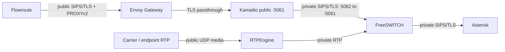

# AVoIP SIP boundary and availability architecture

## Current boundary

Kamailio is the only public SIP boundary. FreeSWITCH and Asterisk are internal
application peers. The public Kamailio Service is currently a mixed Service
with 5061 and 5062; the planned split into `kamailio-public` and
`kamailio-private` waits for the active ACK investigation to close.

The public identity is the site SIP hostname (or `sip.resolvemy.host` when the
opt-in global route is enabled). FreeSWITCH uses only Kamailio's private
ClusterIP identity. RTPEngine owns media anchoring and its public UDP address;
Kubernetes Service load balancing is not treated as safe established-call
media ownership.

The chart's next site-local border target is three Kamailio replicas. The
replicas share TOPOS records through the site-local Dragonfly allocation, use
hostname anti-affinity and spread constraints, and are protected by a
`minAvailable: 2` PodDisruptionBudget. This improves new-call admission during
one pod or node failure, but does not migrate an in-flight TCP/TLS connection,
Kamailio transaction, FreeSWITCH channel, or RTPEngine UDP session.

The pinned common-library version does not render `minReadySeconds`; rollout
safety currently comes from startup/config validation, readiness, zero
rolling-update unavailability, the disruption budget, graceful termination,
and spread constraints. Add a supported raw deployment patch or library
upgrade before treating a minimum-ready dwell time as an availability claim.

## HA progression

The safe order is shared topology state, site-local Kamailio/Envoy replicas,
deterministic FreeSWITCH dialog affinity, tested RTPEngine recovery, and only
then multi-site routing or anycast. Existing dialogs remain site-pinned until
their SIP, B2BUA, and media state can be recovered elsewhere.

See [SIP border](sip-border.md), [topology hiding](topology-hiding.md),
[RTPEngine HA](rtpengine-ha.md), and [failure domains](failure-domains.md).
For node-level TCP debugging during a border incident, use the documented
[Inspektor Gadget procedure](runbooks/sip-border-failure.md#inspektor-gadget-network-debugging).
