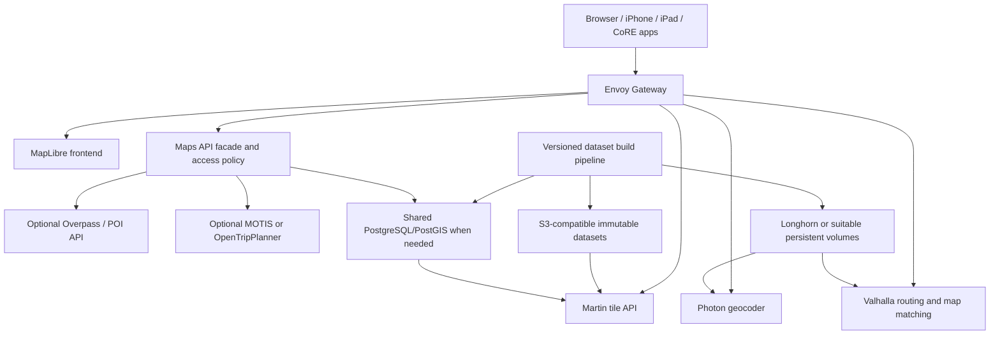

# CoRE Maps

> Planned platform. This directory currently contains documentation only; no
> Maps application, Kubernetes resource, dataset, or endpoint is deployed from
> this checkout.

CoRE Maps is a planned self-hosted geographic platform intended to replace
substantial portions of Google Maps and Apple Maps without making commercial
per-request mapping APIs mandatory. It should provide a reusable geographic
foundation for CoRE applications while remaining useful as an independent map
and routing service.

The platform is expected to provide interactive vector maps, regional
OpenStreetMap data, address and place search, reverse geocoding, driving,
cycling and walking directions, GPS trace map matching, points-of-interest
queries, optional public-transit planning, optional terrain and geographic
overlays, and APIs for other CoRE applications.

The distinctive CoRE Maps feature is contextual routing. A route should be
able to account for the requesting person’s current situation and explicitly
permitted relationships, rather than optimizing only for distance or nominal
travel time. Examples include:

- checking current battery level and recommending a compatible public charging
  stop or a trusted friend’s place where charging is available;
- suggesting a friend or family member as a safe pickup, drop-off, or rest stop
  when the person has opted into sharing availability and location;
- combining public transit, rideshare, walking, cycling, and a friend’s ride in
  one itinerary, such as train → Uber → friend pickup; and
- accounting for each person’s observed walking or running pace, including
  authorized health/fitness summaries, instead of using one generic speed.

These are planned private-context capabilities, not public OSM attributes.
They require explicit consent, short-lived context where possible, clear
explanations for recommendations, and a safe fallback when data is missing or
stale.

## Current status and proposed identity

| Item | Current state | Planned value |
| --- | --- | --- |
| Repository path | `Maps/` exists; documentation only | Helm/Kustomize implementation to be designed |
| Namespace | No Maps namespace exists in this checkout | `core-maps-prod` |
| Argo CD Application | No active Maps ApplicationSet reference was found locally | `core-home1-talos-prod-business-maps-prod` |
| Helm release | Not created | `core-maps` |
| Helm chart | Not created | `maps` |
| Map frontend | Not deployed | `https://maps.mylogin.space` |
| Map API | Not deployed | `https://maps-api.mylogin.space` |

The namespace, application, release, chart, and hostnames are provisional.
Before implementation, confirm the owning
[CoRE-Backplane Business ApplicationSet](https://github.com/K-FOSS/CoRE-Backplane/tree/main/Apps/Business),
cluster selector, destination namespace, injected values, and Lovely renderer.
The repository convention is that an application path is not deployed merely
because it exists in Git.

## What is planned

### Required or primary capabilities

- MapLibre-rendered interactive vector maps.
- Regional OpenStreetMap extracts and a low-zoom global context basemap.
- Forward address/place search and reverse geocoding.
- Driving, cycling, and walking directions.
- GPS trace map matching.
- POI queries and APIs for other CoRE applications.
- Versioned geographic datasets with validation, rollback, and recovery.
- Replication of suitable artifacts between YVR and YXL where supported.

### Optional or later capabilities

- Public transit planning, static schedules, realtime positions, and alerts.
- Terrain, elevation, and other geographic overlays.
- Overpass-style arbitrary OSM queries.
- Business indicators, saved places, and user-owned reviews.
- Offline/mobile map packages.
- Europe-wide expansion beyond selected regional extracts.

None of the above should be read as currently implemented or deployed.

## Initial geographic coverage

### Region A — British Columbia

Primary coverage should include Vancouver, Burnaby, Coquitlam, Port Coquitlam,
Port Moody, New Westminster, Richmond, Surrey, Delta, North Vancouver, West
Vancouver, Langley, Maple Ridge, and the Fraser Valley, with continuous routing
coverage where possible.

The initial source is the
[Geofabrik British Columbia OSM extract](https://download.geofabrik.de/north-america/canada/british-columbia.html).
A smaller Vancouver extract may be evaluated for the proof of concept, but it
must not create disconnected routing islands.

The original transit goal also includes all practical BC Transit services,
Vancouver-area TransLink services, and relevant VIA Rail services. Transit
coverage is a later phase and is independent from basemap coverage.

The Southern Ontario work has an earlier experimental reference in
[K-FOSS/TransitRouting-Lab](https://github.com/K-FOSS/TransitRouting-Lab). That
work should be treated as planning and prior art for a future GO Transit feature,
not as an already-integrated CoRE Maps service.

### Region B — Southern Ontario

Coverage must extend from Ottawa to Windsor and include surrounding communities
and connecting highways, not only the GTA:

- Ottawa and Kingston;
- Belleville and Peterborough;
- Oshawa and Durham Region;
- Toronto, Peel, York, Halton, Hamilton, and Niagara Regions;
- Guelph, Kitchener, Waterloo, Cambridge, and Brantford; and
- London, Sarnia, Windsor, and their connecting corridors.

The initial source is the
[Geofabrik Ontario OSM extract](https://download.geofabrik.de/north-america/canada/ontario.html).
Using the full Ontario dataset is acceptable initially if it is needed to
preserve routing connectivity. A custom Ottawa–Windsor extract may be generated
later, but the corridor must not be split into disconnected city datasets.

Potential future extensions are Gatineau, Detroit, and Buffalo. They require
additional extracts and explicit cross-boundary routing validation.

### Region C — Europe

Selected European metropolitan regions or countries may be added incrementally
from the [Geofabrik Europe extracts](https://download.geofabrik.de/europe.html).
London, Paris, Amsterdam, and Berlin are examples only, not approved initial
coverage. The first deployment must not require a full Europe or planet import.

A low-zoom global basemap should provide context outside detailed regional
datasets, while search and routing coverage are reported separately.

## Proposed architecture



The public-facing map can be independently accessible if its data licensing,
rate limits, and abuse controls are acceptable. APIs that expose private saved
places, personal history, or location-derived data must be separately
authenticated. Private location-history records must never be mixed into
publicly queryable OSM or basemap datasets.

Dawarich should consume CoRE Maps APIs; it must not own the shared map
infrastructure. CoRE Maps must remain usable without Dawarich.

## Component inventory

The following is a candidate inventory, not a commitment to deploy every
component.

| Component | Purpose | Initial status | Important dependency or decision |
| --- | --- | --- | --- |
| [MapLibre GL JS](https://maplibre.org/maplibre-gl-js/docs/) | Browser vector-map rendering | Required | Style, sprite, font, schema, and PMTiles compatibility |
| [Protomaps](https://protomaps.com/) | Portable vector basemap and PMTiles ecosystem | Evaluate | Compare prebuilt extracts with local Planetiler builds |
| [Martin](https://maplibre.org/martin/) | Serve PMTiles, MBTiles, GeoJSON, or PostGIS-backed vector tiles | Required candidate | PostGIS requires a compatible PostGIS version; static archives may need only object storage |
| [Photon](https://github.com/komoot/photon) | Search-as-you-type, place search, and reverse geocoding | Required candidate | OpenSearch-backed index; index build and multi-region strategy must be tested |
| [Nominatim](https://nominatim.org/) | Alternative/additional OSM geocoder | Alternative | Do not make Photon and Nominatim mandatory together |
| [Valhalla](https://valhalla.github.io/valhalla/) | Driving, cycling, walking, map matching, matrices, and isochrones | Required candidate | Regional graph boundaries and graph storage need validation |
| [OpenStreetMap](https://www.openstreetmap.org/) | Primary geographic source | Required | ODbL, attribution, extract freshness, and replication policy |
| [Overpass API](https://wiki.openstreetmap.org/wiki/Overpass_API) | Arbitrary OSM-tag and POI queries | Optional | Avoid operating it until query demand and resource limits are known |
| [MOTIS](https://github.com/motis-project/motis) | Multimodal transit, geocoding, and map services | Transit alternative | Evaluate against OTP for GTFS, GTFS-RT, APIs, memory, and operational fit |
| [OpenTripPlanner](https://www.opentripplanner.org/) | Multimodal transit routing over OSM and GTFS | Transit alternative | Compare with MOTIS; transit must not block maps |
| [Planetiler](https://github.com/onthegomap/planetiler) | Generate regional vector tiles from OSM | Build candidate | Build resource requirements are significant; output schema must match styles |
| [Osmium Tool](https://osmcode.org/osmium-tool/) | Extract, merge, filter, validate, and update OSM data | Required pipeline tool | Use for reproducible regional extracts and change application |
| [PostgreSQL](https://www.postgresql.org/) + [PostGIS](https://postgis.net/) | Custom spatial records and application-specific queries | Conditional | Use shared site-local services only after Backplane configuration is confirmed |
| [Dawarich Atlas](https://github.com/Freika/dawarich) | Existing personal-history mapping frontend/integration | Optional | Primarily documented for Docker Compose; review security and API compatibility |

Avoid deploying duplicate geocoders, transit engines, or tile servers without a
demonstrated need. The first implementation should choose one geocoder and one
transit engine after compatibility testing.

### Contextual routing and TS-TransitRouting

TS-TransitRouting should be a policy and itinerary layer around base routing
engines. The engines can calculate legs and reachable locations; the contextual
layer can rank complete alternatives using permitted personal signals and
relationship-aware options.

Useful itinerary legs include walking or running to a station at the
requester’s measured pace, train or bus to a transfer point, rideshare from the
station to a pickup zone, a friend or family member driving the final leg, and a
public charger or trusted home as a rest/charging stop. The route should also
offer fallbacks if a person declines, becomes unavailable, or the battery,
transit, or traffic state changes.

Personal pace should be derived from an aggregated and time-bounded health or
fitness summary, not raw workout history by default. The model should account
for confidence, terrain, load, weather, accessibility needs, and whether the
trip is walking or running. It must not infer a medical condition or expose
health-derived values to another traveler without permission.

The context layer should support per-trip consent and revocation, separate
scopes for location/battery/health/contacts, relationship permissions for
friend/family availability, minimum battery reserve and charger compatibility,
stale-data timestamps, conservative fallbacks, and a requester-visible audit
trail for sensitive recommendations. Recommendations should explain their
trade-offs, such as “adds 8 minutes but reaches a charger before the reserve
threshold.”

Base engines remain replaceable. A first experiment can compare generic walking
speed with an authorized per-person pace and battery reserve without requiring
a new routing engine. Personal identifiers and health records must never be
placed in URLs, map tiles, public logs, or shared geographic datasets.

### Rail-car and platform-aware guidance

GO Transit planning should eventually account for train size, the train’s
stopping position, and the platform layout to recommend which car or portion of
the platform to use. For example, a route could recommend boarding near the
front or rear of a specific train so the rider exits closer to an accessible
station connection, a transfer path, a pickup point, or the correct platform
exit.

This is more detailed than ordinary GTFS trip planning. It needs a separately
versioned operational model for station platforms, platform walking paths,
train direction, consist/car count, car numbering or ordering, stopping
position, doors/accessible boarding areas, and the target station’s exit or
transfer geometry. Where the information is uncertain, the user should see a
confidence or “best estimate” label rather than a false precise instruction.

The first implementation should treat the
[TransitRouting-Lab](https://github.com/K-FOSS/TransitRouting-Lab) experiments as
the place to recover the original assumptions and test data model ideas. CoRE
Maps can later expose this as an optional rail-guidance layer on top of a normal
GTFS itinerary. It must degrade gracefully to station-level guidance when a
current consist, stop position, or platform assignment is unavailable.

### Prior art that informs the design

[Transitland’s Interline Routing Platform](https://www.transit.land/documentation/routing-platform)
combines transit routing with Valhalla street routing. It is a useful reference
for separating transit and street-routing responsibilities. [Navitia](https://doc.navitia.io/)
is another journey-planning API to study. For open reviews, keep reviews out of
OSM and investigate the [Mangrove Reviews standard](https://mangrove.reviews/standard)
from the [Open Reviews Association](https://open-reviews.org/).

## Dataset lifecycle

Large PBFs, PMTiles, MBTiles, Photon indexes, Valhalla graphs, databases, and
other generated datasets must not be committed to Git. The repository should
contain only code, configuration, manifests, and dataset metadata.

The reproducible pipeline is:

1. Download the selected OSM extract from an approved source.
2. Record source URL, source timestamp/version, license, and checksum.
3. Validate the downloaded PBF and extract or merge it with Osmium.
4. Generate vector tiles with Protomaps/Planetiler or consume a compatible
   immutable PMTiles archive.
5. Prepare the Photon index for the exact geographic coverage.
6. Build Valhalla graphs for the same routing coverage and validate boundaries.
7. Validate tile schema, MapLibre styles, search results, route continuity,
   attribution, and representative journeys.
8. Publish immutable artifacts and a signed or otherwise integrity-checked
   dataset manifest to S3-compatible storage.
9. Switch serving applications to the validated version only after checks pass.
10. Retain the previous known-good version for rollback.

Build artifacts and published serving artifacts should be separate. Heavy
imports must run against scratch or staging storage, not directly against the
production serving index. Not every service supports safe multi-replica access
to one writable index; serving copies should normally be read-only.

Photon’s index format and import behavior must be tested for multi-region and
multi-country use. Do not assume that separate country indexes can be mounted
and queried as one global index. Similarly, separate OSM extracts do not
automatically provide continuous Valhalla routing across their boundaries.

## Storage, replication, backup, and recovery

The planned allocation is:

- OSM PBF downloads and published PMTiles: S3-compatible object storage;
- Photon indexes: suitable persistent block storage or validated read-only
  copies;
- Valhalla graphs: persistent storage or validated read-only copies;
- custom spatial records: shared PostgreSQL/PostGIS only when necessary; and
- temporary tile/index builds: dedicated scratch storage.

The actual bucket, provider, secret-store path, PostgreSQL endpoint, StorageClass,
retention behavior, and replication policy must come from the active Backplane
configuration. Before implementation, review the [storage ApplicationSet](https://github.com/K-FOSS/CoRE-Backplane/blob/main/Apps/Storage/Base.yaml)
and [PostgreSQL ApplicationSet](https://github.com/K-FOSS/CoRE-Backplane/blob/main/Apps/Storage/PSQL.yaml).
No storage defaults in this document override those site-local values.

Recovery should be based on immutable manifests: restore the last validated
dataset version, restore custom PostGIS records from the supported database
backup, repoint serving workloads, and verify search, tiles, routes, and API
access. Evaluate replication between YVR and YXL only after confirming which
artifacts and databases are safe to replicate.

## Kubernetes and GitOps plan

The proposed implementation layout is architectural and should be adapted to
the repository’s existing chart structure:

```text
Maps/
├── Chart.yaml or helm/maps/Chart.yaml
├── README.md
├── TODO.md
├── kustomization.yaml                    # only if the owner renders Kustomize
├── values.yaml
├── templates/ or helm/maps/templates/
├── config/
│   ├── martin/
│   ├── photon/
│   ├── valhalla/
│   └── maplibre/
├── datasets/                             # metadata, not large artifacts
└── jobs/                                  # manifests/config, not generated data
```

The repository most commonly uses an application Helm chart with the
[BJW-S common library](https://bjw-s-labs.github.io/helm-charts/docs/common-library/)
for supported controllers, Services, routes, persistence, and ConfigMaps. The
current checkout contains both 4.x and 5.x examples; several current charts
use BJW-S Common `5.0.1`, but Maps must verify the compatible version, Helm
requirements, and upstream release notes before creating `Chart.yaml`.

Possible common-library controllers are `tiles`, `photon`, `valhalla`, and
`maplibre`; `overpass` and `transit` should be disabled until needed. Use
independent probes, resources, volumes, and Services. Keep operator-specific
resources or unsupported APIs as explicit templates and document the exception.

If the eventual owner uses Kustomize, `kustomization.yaml` should compose the
chart output and only the required standalone resources. The final Argo CD
rendering may include ApplicationSet-injected Helm values and Kustomize merges
through Lovely; standalone `helm template` or `kustomize build` will be only a
partial check until that owner is known.

### Repository conventions to preserve

- Existing charts use release-derived `app.kubernetes.io` identity labels and
  values-driven cluster, domain, gateway, and namespace settings.
- Most current HTTP exposure uses Gateway API `HTTPRoute`, commonly attached to
  the site-local `main-gw` and an injected `https-myloginspace` listener; the
  actual target must be confirmed by the owning ApplicationSet.
- Secrets are normally delivered by External Secrets, PushSecrets, or
  Crossplane connection Secrets. No credential values belong in this directory.
- PostgreSQL, S3, and other platform services are shared/site-local concerns;
  Maps should not bundle duplicate databases or object stores.
- Authentik, if required for private APIs or the map frontend, must be designed
  with the current [mylogin.space User resource definition](https://github.com/K-FOSS/CoRE-Backplane/blob/main/Operations/SSO/User/templates/User/UserResourceDef.yaml),
  Authentik application/group bindings, Gateway policy, and redirect URIs as
  one access path.
- Forecastle is for public services only. Any future public route must use the
  repository’s required Forecastle annotations and a friendly display name;
  private history and administrative endpoints must not be exposed there.
- There is no Maps-specific Argo CD naming or namespace convention to copy yet,
  so the provisional values above need owner confirmation.

## API and endpoint design

The eventual API facade should expose stable, versioned contracts rather than
leaking every upstream service directly:

- `/v1/search` and `/v1/reverse` for geocoding;
- `/v1/route` for driving, cycling, walking, and later transit requests;
- `/v1/match` for authorized GPS trace matching;
- `/v1/tiles/{dataset}/...` or a compatible tile URL for vector tiles;
- `/v1/places` for public OSM-linked POI queries; and
- separate authenticated endpoints for saved places, reviews, and personal
  history.

`maps.mylogin.space` is the planned interactive frontend. `maps-api.mylogin.space`
is the planned API hostname. Public map tiles and API endpoints must have
explicit rate limits, CORS policy, cache behavior, attribution, and abuse
controls. Private endpoints should use Authentik or the repository’s approved
access mechanism; the exact Authentik provider and entitlement model is an
unresolved implementation decision.

## Integrations

### Dawarich and personal history

- Point Dawarich at self-hosted tiles and a compatible reverse geocoder.
- Evaluate Valhalla map matching for GPS traces against the supported Dawarich
  version and API contracts.
- Preserve existing location-history records and source identifiers.
- Allow authorized search over previously visited places and timestamps.
- Keep all personal-history queries private and separate from public OSM data.

The existing [Personal Fitness](../Personal/Fitness/) and
[Personal History](../Personal/History/) applications are potential sources for
aggregated pace and activity context. Maps should request a narrow, derived
summary such as a recent walking-speed range rather than ingesting raw health
records. The owning applications and their access policies must remain the
authorities for those records.

Dawarich is documented primarily as a Docker Compose application and may have
container-management assumptions. Do not transplant Docker-socket management
into Talos; prefer individually managed Kubernetes workloads and review the
supported tile, geocoding, and map-matching interfaces first.

### Immich, Home Assistant, and local AI

- Evaluate Immich map APIs and correlate photos through Dawarich or stable
  source identifiers rather than duplicating complete datasets.
- Provide private map rendering and geocoding to Home Assistant without
  exposing tracked devices or private zones.
- Expose authenticated local-AI tools for place search, reverse geocoding,
  routing, POI queries, and explicitly authorized personal-history queries.
- Allow OpenWebUI and a custom crawler/search index to consume public APIs only
  within their assigned access scope.

## Public transit phase

Transit is intentionally later and must not block the initial maps deployment.
Candidate engines are [MOTIS](https://github.com/motis-project/motis) and
[OpenTripPlanner 2](https://docs.opentripplanner.org/). Evaluate them as
alternatives, not as simultaneous mandatory services.

Initial data investigations should cover:

- Vancouver: [TransLink developer resources](https://www.translink.ca/about-us/doing-business-with-translink/app-developer-resources)
  and authorized GTFS/GTFS-Realtime feeds;
- British Columbia: [BC Transit Open Data](https://www.bctransit.com/open-data/);
- Ontario: GO Transit and UP Express through Metrolinx, subject to feed access
  and license review; and
- Ottawa: OC Transpo, followed by TTC and other operators along the
  Ottawa–Windsor corridor.

The transit pipeline must validate static feeds against the
[GTFS Schedule specification](https://gtfs.org/documentation/schedule/reference/)
and realtime feeds against the
[GTFS Realtime specification](https://gtfs.org/documentation/realtime/). The
[MobilityData GTFS Validator](https://github.com/MobilityData/gtfs-validator)
is a candidate validation tool. Do not assume realtime feeds are public or
credential-free.

The original transit-routing idea remains valid: a future TS-TransitRouting
layer can compare context-aware itinerary ranking against OTP or MOTIS results,
including transfer reliability, accessibility, walking distance, operator
preference, weather, and place context.

## Security and observability

Follow existing CoRE security conventions:

- Envoy Gateway for HTTP exposure and explicit public/private route separation;
- Authentik where private access or user entitlements are required;
- Vault or the repository’s existing External Secrets integration for secrets;
- NetworkPolicies, least-privilege ServiceAccounts, and no broad Kubernetes API
  or host-container-runtime access; and
- no public administrative interfaces.

Use the existing Grafana, Mimir, Loki, and Tempo stack where the owning
deployment makes it available. Monitor service health, HTTP latency, search and
routing latency, tile success/error rates, dataset freshness, storage usage,
import/build status, and failed jobs. Add black-box checks for a real map tile,
search, reverse lookup, and representative route rather than relying only on
pod readiness or TCP reachability.

## Licensing and attribution

The implementation must document and comply with:

- [OpenStreetMap copyright and license](https://www.openstreetmap.org/copyright)
  and ODbL attribution/share-alike obligations;
- [OpenStreetMap tile usage policy](https://operations.osmfoundation.org/policies/tiles/);
- licenses for Protomaps, Planetiler, Martin, MapLibre, Photon, Valhalla,
  transit engines, and any selected frontend;
- agency-specific transit-feed terms and redistribution restrictions; and
- licenses for custom geographic overlays and reviews.

The platform must use approved extracts and must not bulk-download public
`openstreetmap.org` tiles. Free/open-source software and freely downloadable
data are not the same thing. Self-hosting removes commercial per-request API
dependence but does not remove storage, compute, bandwidth, maintenance, or
licensing obligations.

## Open design decisions and blockers

- Confirm an active Backplane owner, destination namespace, cluster set, and
  renderer before creating deployment files.
- Select a tile strategy: Protomaps prebuilt regional PMTiles versus local
  Planetiler builds.
- Select one initial geocoder: Photon versus Nominatim.
- Define the API facade and whether direct Martin/Photon/Valhalla endpoints are
  private implementation details.
- Estimate memory, CPU, scratch space, persistent storage, and build duration
  for BC and Ontario before choosing workloads and replica counts.
- Confirm site-local S3, PostgreSQL/PostGIS, StorageClass, backups, and YVR/YXL
  replication behavior from Backplane.
- Choose MOTIS or OpenTripPlanner after a representative GTFS/GTFS-RT trial.
- Recover and document the early GO train/platform/car-position assumptions from
  [TransitRouting-Lab](https://github.com/K-FOSS/TransitRouting-Lab).
- Model GO station platforms, train direction, consist size, car ordering,
  stopping position, accessible boarding, platform walking paths, and exits as
  versioned operational data.
- Prototype recommending the best boarding car or platform portion for a
  selected GO itinerary, with confidence and station-level fallback behavior.
- Define “business indication” precisely: open now, accessibility, personal
  recommendation, transit proximity, or another signal.
- Define which CoRE systems are authoritative for battery, health/fitness
  summaries, contacts, trusted relationships, rideshare state, and
  friend/family availability.
- Define consent and revocation for sharing a pickup location or allowing a
  trusted person to become a route leg.
- Define behavior when a friend, charger, transit feed, or health signal is
  unavailable during an active trip.
- Define review ownership, moderation, licensing, deletion, and OSM identity
  linking before accepting user content.
- Confirm Dawarich, Immich, Home Assistant, and local-AI API compatibility.

## Official references and implementation examples

- [OpenStreetMap](https://www.openstreetmap.org/) and
  [OSM attribution/license](https://www.openstreetmap.org/copyright)
- [MapLibre GL JS](https://maplibre.org/maplibre-gl-js/docs/) and
  [MapLibre Native](https://maplibre.org/projects/native/)
- [Martin documentation](https://maplibre.org/martin/)
- [Protomaps](https://protomaps.com/) and
  [PMTiles](https://github.com/protomaps/PMTiles)
- [Photon source and API](https://github.com/komoot/photon)
- [Nominatim](https://nominatim.org/)
- [Valhalla documentation](https://valhalla.github.io/valhalla/) and
  [map-matching API](https://github.com/valhalla/valhalla-docs/blob/master/map-matching/api-reference.md)
- [Planetiler](https://github.com/onthegomap/planetiler)
- [Osmium Tool manual](https://osmcode.org/osmium-tool/manual)
- [MOTIS](https://github.com/motis-project/motis)
- [OpenTripPlanner](https://www.opentripplanner.org/) and
  [OTP 2 documentation](https://docs.opentripplanner.org/)
- [GTFS Schedule](https://gtfs.org/documentation/schedule/) and
  [GTFS Realtime](https://gtfs.org/documentation/realtime/)
- [MobilityData GTFS Validator](https://github.com/MobilityData/gtfs-validator)
- [BJW-S Common library](https://bjw-s-labs.github.io/helm-charts/docs/common-library/)
- [Gateway API](https://gateway-api.sigs.k8s.io/),
  [External Secrets](https://external-secrets.io/latest/), and
  [Authentik proxy/OIDC documentation](https://docs.goauthentik.io/add-secure-apps/)

## Recommended first implementation step

Before creating Kubernetes resources, build a non-deployed Vancouver proof of
concept: acquire a permitted BC extract, record its metadata and checksum,
generate a small compatible vector-tile archive, build a minimal Photon or
Nominatim search index, and validate one Valhalla walking/driving route. Use the
results to size storage and memory, decide whether PMTiles or Martin should be
the initial serving path, and then confirm the Backplane deployment owner.
