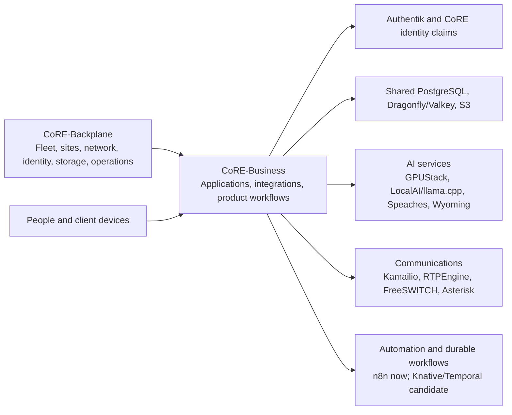
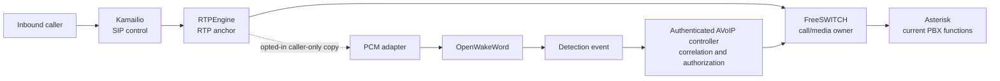

# CoRE-Business architecture and long-term plan

**Planning baseline: 2026-10-09.** This is the portfolio-level architecture
and roadmap for application services in CoRE-Business. The plans distinguish
repository implementation from deployment configuration and from live
operational evidence. Current claims below are based on this checkout, its
repository documentation, and the named Backplane files fetched on the
planning date; except where a component tracker records an operator report,
this work did not independently inspect live clusters.

## 1. Executive architecture summary

CoRE-Business is the application layer: it implements business and personal
services, their application-specific configuration, and their integrations
with platform APIs. [CoRE-Backplane](https://slop.writemy.codes/CoRE/CoRE-Backplane)
owns fleet selection, cluster and site infrastructure, shared data services,
networking, identity foundations, storage, and deployment reconciliation.
Neither repository should silently take ownership of the other's layer.

The intended platform composes existing Kubernetes services into an
authenticated, site-aware application environment. Applications use Gateway
API for HTTP ingress, platform identity and service claims, shared PostgreSQL,
Dragonfly/Valkey and S3 where appropriate, and common logging, metrics,
tracing, backup and restore practices. Business-specific call media stays on
the real-time AVoIP path; AI, workflows and application services consume
separate authenticated APIs and events.

Priority sequence: first reconcile current desired state with observed service
behavior and close operational/security gaps; then build a bounded wake-word
and caller-audio proof of concept; next establish repeatable model and workspace
workflows; then expand durable automation, identity/onboarding and product
capabilities. Real-time RTP and voice service must not depend on an AI worker,
scale-to-zero HTTP endpoint, or durable workflow engine being available.

## 2. Current CoRE-Business capabilities and evidence

The repository contains Helm, Lovely-compatible and Kustomize application
units. The root [README](README.md) and [repository guide](docs/REPOSITORY.md)
list the active owners recorded in the current checkout. ApplicationSet
presence and values establish configured deployment intent; they do not prove
that pods are healthy, a feature is enabled at a target site, or a user flow
works.

| Area | Repository evidence and status | Current limit |
| --- | --- | --- |
| AI | **Implemented — repository verified.** `AI/` contains OpenWebUI, GPUStack, LocalAI/llama workload templates, Speaches, Wyoming bridge, MCP integrations and Paperclip. The fetched [AI ApplicationSet](https://slop.writemy.codes/CoRE/CoRE-Backplane/src/branch/main/Apps/Business/Tools/AI.yaml) targets Home1 and YVR bare-metal infrastructure clusters; [AINode2](https://slop.writemy.codes/CoRE/CoRE-Backplane/src/branch/main/Apps/Business/Tools/AINode2.yaml) selects bare-metal infrastructure clusters and injects LocalAI/llama enablement. | Effective per-cluster values, model availability and live service health require cluster verification. AI documentation conflicts with checked-in Speaches tags and traffic weights; see §18. |
| AVoIP | **Implemented — repository verified; deployment configured.** [AVoIP](AVoIP/README.md) contains Kamailio, RTPEngine, FreeSWITCH, Asterisk and supporting call services. The fetched [AVoIP ApplicationSet](https://slop.writemy.codes/CoRE/CoRE-Backplane/src/branch/main/Apps/Business/AVoIP.yaml) enables telephony at DC1/YXL and Home1/YVR and disables Asterisk/FreeSWITCH on the `dc1-k3s-node1` spoke. | The operator reports multi-minute voice calls, internal SIP registration/Home Assistant calling, resolution of the earlier roughly 30-second failure, successful fax images, and an Asterisk delayed callback that plays GG audio. The tracker separately records a Homer-correlated 129-second call and reported Home1 G.711 fax success. These are **Reported working**, not independently verified here; full ACK/BYE acceptance, site failover and active-call survival remain open. |
| Office, mail, projects and collaboration | **Implemented — repository verified; active owners recorded.** Nextcloud/Collabora, Mail, OpenProject, Matrix, Mastodon and supporting services have application code and named active Backplane owners in the root README. | Current live health, regional recovery and end-user onboarding are separate acceptance work. MatrixRTC and Talk expansion remain planned or unverified. |
| Automation and utilities | **Implemented — repository verified.** n8n is owned by the [Automation ApplicationSet](https://slop.writemy.codes/CoRE/CoRE-Backplane/src/branch/main/Apps/Business/Automation.yaml); active utility owners are enumerated in [README](README.md). | Knative and Temporal are future platform directions, not current CoRE-Business services. |
| Business and personal applications | **Partial.** Many charts exist for Finance, ERP, analytics, education, knowledge, health and personal workflows. | A chart is not deployment evidence. Some paths have no active owner, are opt-in, or are exploratory; avoid promoting them without an explicit product and operations case. |

For this roadmap, “deployed” means backed by live controller or user-flow
evidence. No new live checks were performed for this baseline. The AVoIP
tracker records **Reported working** milestones, including a roughly
129-second call with a complete Homer recording and Home1 G.711 fax reception;
their remaining acceptance evidence is still listed in that tracker. The
WSS-specific baseline in [SIP-STATEFUL-HA.md](AVoIP/docs/SIP-STATEFUL-HA.md)
records observations dated 2026-10-09, but this planning task did not
independently verify them.

## 3. Architectural principles

1. **One owner per platform concern.** Reuse Backplane capabilities and
   ApplicationSets; put application-specific behavior in CoRE-Business.
2. **Evidence before status.** Mark code, configured deployment, operator
   report and observed acceptance distinctly. A successful render is not a
   production acceptance test.
3. **Site and failure boundaries are explicit.** State locality, network
   reachability, data replication semantics, recovery ownership and degraded
   behavior for each service. Do not infer shared writable state from the
   presence of multiple sites.
4. **Real-time paths stay bounded.** RTP, SIP ownership and media execution
   cannot wait on model loading, a workflow, or scale-from-zero.
5. **Identity and authorization precede automation.** A detection, model
   output or agent proposal is an event, not permission to execute an action.
6. **Minimize retained sensitive data.** No call audio or training corpus is
   retained by default; define consent, purpose, access, retention and deletion
   before enabling recording or ingestion.
7. **Reusable APIs before duplicated apps.** Document what OpenWebUI,
   Paperclip, n8n, existing MCP services and shared platform APIs do before
   adding overlapping systems.
8. **Rollback is designed with rollout.** Preserve stable identities and
   data, test restore paths, and define fail-open/fail-closed behavior before
   changing a critical service.

## 4. Portfolio boundaries and ownership

CoRE-Business owns application code, application chart values/templates,
application identity claims, application routes and application acceptance
tests. CoRE-Backplane owns active ApplicationSets, cluster/site selection,
fleet-level values, shared service operators, networking and gateways,
storage policy, shared databases, identity APIs/compositions, and platform
monitoring. Application teams must propose a Backplane change when a dependency
or capability is platform-owned; they must not vendor or deploy a duplicate.

Key current owners include [AI](https://slop.writemy.codes/CoRE/CoRE-Backplane/src/branch/main/Apps/Business/Tools/AI.yaml)
and [AINode2](https://slop.writemy.codes/CoRE/CoRE-Backplane/src/branch/main/Apps/Business/Tools/AINode2.yaml),
[AVoIP](https://slop.writemy.codes/CoRE/CoRE-Backplane/src/branch/main/Apps/Business/AVoIP.yaml),
[Office](https://slop.writemy.codes/CoRE/CoRE-Backplane/src/branch/main/Apps/Business/Office.yaml),
[Mail](https://slop.writemy.codes/CoRE/CoRE-Backplane/src/branch/main/Apps/Business/Mail.yaml),
[Projects](https://slop.writemy.codes/CoRE/CoRE-Backplane/src/branch/main/Apps/Business/Projects.yaml),
[Automation](https://slop.writemy.codes/CoRE/CoRE-Backplane/src/branch/main/Apps/Business/Automation.yaml),
[Matrix](https://slop.writemy.codes/CoRE/CoRE-Backplane/src/branch/main/Apps/Business/Social/Matrix.yaml),
[Fediverse](https://slop.writemy.codes/CoRE/CoRE-Backplane/src/branch/main/Apps/Business/Social/Fediverse.yaml),
and the [Personal Finance](https://slop.writemy.codes/CoRE/CoRE-Backplane/src/branch/main/Apps/Business/Personal/Finances.yaml)
owner. The complete active and legacy inventory is in the root README and
Backplane's `Apps/Business/` tree.

The fetched [PostgreSQL owner](https://slop.writemy.codes/CoRE/CoRE-Backplane/src/branch/main/Apps/Storage/PSQL.yaml),
[MySQL owner](https://slop.writemy.codes/CoRE/CoRE-Backplane/src/branch/main/Apps/Storage/Database/MySQL.yaml),
[MongoDB owner](https://slop.writemy.codes/CoRE/CoRE-Backplane/src/branch/main/Apps/Storage/Database/MongoDB.yaml),
[storage owner](https://slop.writemy.codes/CoRE/CoRE-Backplane/src/branch/main/Apps/Storage/Base.yaml),
[Dragonfly owner](https://slop.writemy.codes/CoRE/CoRE-Backplane/src/branch/main/Apps/Storage/Dragonfly/CoRE.yaml),
[Valkey operator owner](https://slop.writemy.codes/CoRE/CoRE-Backplane/src/branch/main/Apps/Storage/Valkey/Operator.yaml),
and [User XRD](https://slop.writemy.codes/CoRE/CoRE-Backplane/src/branch/main/Operations/SSO/User/templates/User/UserResourceDef.yaml)
are the platform boundaries for those resources. The fetched current
[User Composition](https://slop.writemy.codes/CoRE/CoRE-Backplane/src/branch/main/Operations/SSO/User/templates/User/UserComposition.yaml)
contains Authentik, PostgreSQL, S3 and MongoDB implementation branches, while
the repository's `AGENTS.md` still says MongoDB is schema-only (and MySQL is
schema-only). This policy/source discrepancy needs reconciliation against the
deployed Composition revision and provider state. The fetched Composition has
no MySQL branch. Until the effective provider and Composition are confirmed,
do not infer provisioning from accepted XRD fields; this still does not make a
chart-private database appropriate. Shared Dragonfly database allocations are tracked by
the Backplane [allocation registry](https://slop.writemy.codes/CoRE/CoRE-Backplane/src/branch/main/Storage/Dragonfly/CoRE/README.md).

## 5. Cross-cutting platform dependencies

| Dependency | Owner / contract | Roadmap requirement |
| --- | --- | --- |
| Kubernetes, Talos, Cilium, ClusterMesh | Backplane [network base](https://slop.writemy.codes/CoRE/CoRE-Backplane/src/branch/main/Network/Base) and [network ApplicationSet](https://slop.writemy.codes/CoRE/CoRE-Backplane/src/branch/main/Apps/Network/Base.yaml) | Place CPU/GPU, stateful and real-time work with explicit node/site constraints. ClusterMesh service discovery is not proof of remote health or shared persistence. |
| Envoy Gateway, Gateway API, DNS | Backplane [Ingress ApplicationSet](https://slop.writemy.codes/CoRE/CoRE-Backplane/src/branch/main/Apps/Network/Ingress.yaml), [DNS ApplicationSet](https://slop.writemy.codes/CoRE/CoRE-Backplane/src/branch/main/Apps/Network/DNS.yaml), and network service discovery | App-owned HTTPRoutes and policies must match listener, authorization, DNS and exposure rules. SIP signaling and RTP UDP are not generic HTTP gateway traffic. |
| Argo CD, Lovely, Helm/Kustomize, Forgejo CI | Backplane owns ApplicationSets/plugin; Business owns app sources | Render full composition with injected values and pin supply-chain inputs. Add CI gates for docs and app-specific schemas without changing deployment ownership. |
| Authentik, LDAP, User claims, Crossplane | Backplane owns platform identity APIs/providers; apps declare claims and app policy | Verify groups, entitlements, service identity, secret publication and external resource deletion as one lifecycle. |
| PostgreSQL, Dragonfly, Valkey and S3 | Backplane shared service owners | Request site-local service identities and explicit allocations. Define backup/restore and data locality; do not assume active-active writes across sites. |
| Longhorn and S3 backup targets | Backplane storage owner | Document PVC retention, replicas, backup destinations and tested restore. Storage replication is not application consistency or disaster recovery proof. |
| OpenNMS, NetBox, Mimir/Prometheus, Loki, Tempo, Grafana-compatible dashboards | Backplane observability and inventory | Define common service labels, metrics, logs, traces, alerts, SLOs, runbooks and capacity signals. Homer remains the SIP/media diagnostic system. |
| GPU/runtime resources, Multus, SR-IOV, KubeVirt | Backplane operators and cluster configuration | Business workloads consume declared resources; training queues must not starve latency-sensitive speech or other production work. |

Site placement needs explicit treatment for Home1/YVR, Home2/YVR, DC1/YXL,
and any future YYZ expansion. Preserve locality and recovery boundaries. Review
the historical YXL personal/non-commercial constraint against current
commercial deployment intent before placing customer workloads there; this is
a policy item to confirm, not a claim of current violation. For networking
fabric details such as EVPN/VXLAN, BGP/VRFs, OSPF, anycast, Cilium BGP, DNS/GSLB,
split-horizon DNS, WireGuard/GRE and MTU, defer to Backplane's network plans
rather than duplicate them here.

## 6. AI and inference

The detailed architecture and engineering backlog are [AI/PLAN.md](AI/PLAN.md)
and [AI/TODO.md](AI/TODO.md). Current repository services include GPUStack,
OpenWebUI, Speaches/faster-whisper, Wyoming's OpenAI-compatible bridge,
MCP search integration and Paperclip. The chart also contains LocalAI and
llama workload support enabled by the AINode2 value layer. Do not infer all
defaults are active in every target. The first AI platform work is inventory,
testable API contracts and model/runtime measurements, not deploying every
serving framework.

The selected wake-word directions are distinct: server-side
[OpenWakeWord](https://github.com/dscripka/openWakeWord) for
CoRE Kubernetes and microWakeWord for Voice PE ESP32 firmware. Existing “Hey
Jarvis” behavior on Home Assistant Voice PE is user-reported context; the
device model is built into ESPHome firmware and is not evidence of a server
OpenWakeWord artifact. The initial Hey CoRE artifact does not exist until a
reproducible training/evaluation process produces and versions one.

## 7. Voice AI and model training

Voice AI depends on model/data licensing, reproducible datasets, authenticated
streaming transport, CPU capacity and—in call scenarios—a media forwarding
contract. Separate real-time inference from training: OpenWakeWord starts
CPU-first; microWakeWord training and quantization use isolated developer
workspaces and scheduled Jobs. A model registry can initially use immutable
S3 objects plus Git metadata, checksums and evaluation reports; compare Harbor
artifact support before adding a dedicated registry service.

Evaluation must report false accepts per hour, false rejection rate, detection
latency, CPU/memory, speaker/noise variation and artifact provenance. Include
telephone-bandwidth and G.711/codec/noise augmentation for AVoIP. OpenWakeWord
and microWakeWord artifacts are separate runtimes; do not assume conversion
between them. Full datasets are access-controlled and never copied into a
public repository.

## 8. Developer workspaces and serverless functions

JupyterHub with Authentik OIDC and KubeSpawner is the selected direction for
notebooks and training. It is not automatically a replacement for full IDE
workspaces. Define shared workspace identity, images, quotas, storage, network
policy, secrets and resource profiles; evaluate Eclipse Che or code-server
only where notebook environments do not meet developer needs. Training
workspaces must not access production SIP administration, RTPEngine control or
carrier credentials.

[Knative](https://knative.dev/docs/) is the selected candidate for
authenticated HTTP/event functions and [Temporal](https://docs.temporal.io/)
for durable, retryable workflows, subject to requirements and
platform-operator verification. A Functions developer experience may add
Forgejo templates, CI builds, Harbor publishing, promotion, preview
environments, logs/traces and rollback. It is a phased platform, not a
prerequisite for AI or telephony. A low-latency media decision never waits on
Temporal or a scale-to-zero service.

## 9. AVoIP and programmable communications

The detailed state, implementation phases and acceptance ledger remain in
[AVoIP/TODO.md](AVoIP/TODO.md), [SIP-STATEFUL-HA.md](AVoIP/docs/SIP-STATEFUL-HA.md),
and the AVoIP call-flow/runbook documentation. The selected roles are Kamailio
for SIP signaling and routing, RTPEngine for RTP anchoring and media
observation, FreeSWITCH as the scalable media/switchboard execution tier, and
Asterisk as the current private PBX and existing dialplan/callback owner while
migration is evaluated. Do not remove Asterisk prematurely.

**Selected lab scenario (planned, not implemented):** on an opted-in inbound
call, fork caller-only media from the owning RTPEngine to a PCM adapter; send
PCM16 mono 16 kHz audio to an authenticated OpenWakeWord service; correlate a
detection event to the SIP dialog and FreeSWITCH channel owner; let a
separately authorized controller request the owning FreeSWITCH worker to mix
the “GG” test sound toward internal extension 7102. Normal RTP forwarding
continues if any AI component fails. No raw call audio is stored by default,
and a detection alone is never an authorized command.

The wider AVoIP backlog is intentionally not a dependency for the wake-word
lab. It includes:

| Workstream | Candidate capabilities | Current portfolio state |
| --- | --- | --- |
| Identity and endpoints | OIDC web softphone, SIP.js/WebRTC, LDAP-backed directory, SIP Digest issuance, Authentik entitlements, Cisco 7975 provisioning, NetBox phone inventory, presence/subscriptions, multiple contacts, device handoff, STUN/TURN/ICE/NAT traversal | **Planned/Research.** Credential issuance, dynamic registrar and browser-call acceptance remain open in the [AVoIP tracker](AVoIP/TODO.md). |
| Call services | Durable callback scheduler, queues, voicemail, explicit-policy call recording, fax web UI and S3 storage | **Partial/Planned.** Preserve current Asterisk and FreeSWITCH call/fax functions while ownership and retention are validated. |
| Carrier and external services | STIR/SHAKEN, E911 location handling, verified caller ID, authorized caller identity selection, Teams Direct Routing, SMS | **Research/Blocked by provider or compliance.** Do not claim compliance or carrier acceptance from configuration. |
| RTC and AI | SIP/Matrix integration, LiveKit SIP/Agents, conversational AI agents, real-time transcription/synthesis, AI-driven IVR, RTC/conferencing | **Planned/Research.** Requires separate identity, media, consent, site-locality and recovery contracts. |

Carrier- and compliance-dependent work is gated on legal, provider and
operational review. In particular, verified caller identity, E911 delivery,
STIR/SHAKEN and billable outbound calling are not considered solved.

## 10. Identity and onboarding

Build a consistent user, tenant and device lifecycle from Authentik, LDAP and
Backplane service identity resources. Plan OIDC SSO, group/entitlement
provisioning, auditable credential issuance/rotation, device enrollment and
suspension. User-facing onboarding should minimize repeated account setup for
Nextcloud, CardDAV/CalDAV, mail, web SIP/phones, Matrix, AI and workspaces.
Evaluate standards-based discovery and provisioning (including app-specific
profiles) while documenting client-specific limits. Universal SSO across
IMAP, SIP, CardDAV and CalDAV clients is not assumed.

The current Backplane User resource and its actual Composition are the source
for platform service identity behavior. The composition must be inspected
before planning new claim fields as working provisioning capabilities.

## 11. Office, collaboration, Matrix, RTC and Mail

**Office/Nextcloud:** preserve regional service availability and data recovery;
verify PHP-FPM/nginx and worker scaling, Cron/task processing, notify_push,
WebDAV/CalDAV/CardDAV, Talk, HPB/TURN, shared object storage, database
availability, permissions, onboarding and Safari/iOS behavior. The current
repo contains active Office code and site integrations; regional DR and each
client workflow require their own evidence.

**Matrix:** Synapse/MAS, Authentik, federation, encryption-key recovery,
MatrixRTC, Element Call, LiveKit, SIP/Matrix gateway and site-local media/TURN
must be planned with authorization, federation and restore boundaries. The
Matrix chart is an active implementation path; MatrixRTC and SIP bridging are
not accepted as working from chart presence.

**Mail:** retain Postfix, Dovecot, Rspamd, Maddy, DKIM/SPF/DMARC and current
multi-site credential ownership. Prioritize delivery reliability, observability,
alias lifecycle and restore. Nextcloud Mail and AI-assisted workflows are
integration proposals. Investigate any duplicate-send report independently;
an IMAP performance change alone is not evidence of resolving it.

## 12. Business applications and billing

The independent business-services direction includes multi-tenant customer
onboarding, subscriptions, Stripe as a candidate payment provider, usage
metering, entitlements, cost attribution, customer portal, invoices,
notifications, payment webhooks, reconciliation and financial reporting.
These are proposals that need a current product and operating case. First
decide which services are personal, internal platform, provider infrastructure
or customer products; separate their costs, legal terms and security domains.

Finance automation may evaluate Firefly III (current repository implementation),
budgets, transaction normalization, reporting and reconciliation. Initiate no
payment or money transfer automatically. Any finance integration needs
least-privilege APIs, approval, immutable audit evidence and reconciliation.

## 13. Automation and agentic systems

n8n is the current automation implementation path. Temporal is the proposed
durable workflow engine for delayed callbacks, onboarding, provisioning,
notifications, AI tasks, scheduled processing and human approvals. Knative
functions serve synchronous/event-triggered code. Use explicit API contracts
between them; neither owns RTP.

AI agents may eventually provide planning, research, personal/organizational
briefs, schedule suggestions, task prioritization, communications assistance,
document retrieval, code review and CI/operations summaries. Optional approved
sources include Markdown/Obsidian/Git, Nextcloud, tasks, OpenProject, email and
Home Assistant state. Define tenant/source permissions, provenance, retention,
prompt-injection resistance and retrieval boundaries. A private planning model,
controlled tool executor and final-response model are candidates to evaluate.
All write actions require scoped authorization, audit, idempotency and
human approval when impact is high. Test tool authorization, exfiltration,
unintended actions and hostile document content.

## 14. Supporting applications

Classifications are portfolio guidance; active ownership still comes from
Backplane and must be checked before implementation.

| Portfolio | Current repository examples | Portfolio treatment |
| --- | --- | --- |
| Projects and tasks | OpenProject, Tasks, Personal/Tasks | **Active maintenance.** Integrate onboarding and notifications after identity contracts are stable. |
| ERP/CRM and analytics | ERPNext, Analytics | **Legacy/ownership review.** The [ERP ApplicationSet](https://slop.writemy.codes/CoRE/CoRE-Backplane/src/branch/main/Apps/Business/Legacy/ERP.yaml) is under the Legacy path; no current Analytics owner was found in the active Business owner inventory. Verify status before strategic investment. |
| Knowledge and document tools | Knowledge, conversions, CyberChef, Draw.io, sharing | **Active maintenance** for explicitly owned utilities; **optional exploration** for a cross-app RAG layer. Knowledge and some document utilities have no active owner in the current Business owner inventory. |
| Communication | Mattermost under `Communication/` | **Optional future exploration / owner review.** Repository definitions exist, but no active Business ApplicationSet owner was found in the current tree. |
| Education and development | Education, Desktop, Browsers, Terminal | **Planned platform integration.** Common Authentik identity, workspace isolation, quotas and CI images precede expansion. |
| Automation | n8n and BusinessProcesses | n8n is **Implemented — repository verified** with an active Automation owner. BusinessProcesses has repository code but no active owner in the current Business owner inventory; review overlap before promoting it or introducing Temporal. |
| Landing/service discovery | Landing, Forecastle discovery | **Active maintenance.** Maintain public/private exposure rules and correct friendly names. |
| Social/federated | Mastodon via Fediverse; optional Bluesky PDS and Tranquil/AT Protocol code; PeerTube and Lemmy future | **Active maintenance** for Mastodon; **partial/optional** for the two Bluesky implementations (verify effective site values separately); **future exploration** for PeerTube/Lemmy. Plan ActivityPub and AT Protocol identity/onboarding opportunities, S3 media, federation health and cross-site recovery without claiming protocol interoperability is solved. |
| Personal and experimental | Finance, Fitness, Travel, History, Behavior, Ambient and other directories | **Active maintenance** only where an owner and user need exist; otherwise **optional future exploration** or **legacy/retirement review**. A directory alone is not a commitment. |

## 15. Security, reliability, HA and observability

Security baseline: Authentik/OIDC where supported; SIP-specific device and
trunk authentication; least-privilege workload identity and service accounts;
External Secrets/Vault lifecycle; Cilium policy; mTLS where appropriate;
tenant separation; audit trails; credential rotation; minimal data retention;
and pinned/signed supply-chain inputs. Never place production credentials or
private model datasets in Git.

Reliability baseline: document service and dialog ownership, site-local
dependencies, endpoint health/drain behavior, replication semantics, backup
coverage, restore drills, database failure modes, S3 replication and RPO/RTO.
Valkey/Redis-backed signaling or media metadata does not prove live SIP dialog,
WebSocket or RTP session recovery. Report measured objectives only after
failure tests at the named layer.

Observability baseline: common labels and dashboards across OpenNMS,
NetBox, Prometheus/Mimir, Loki, Tempo and Grafana-compatible tooling; app
health, saturation, request/error/latency metrics; structured logs without
secrets/audio; traces across gateways and workflows; Homer for SIP; paging
thresholds; capacity forecasts; runbooks; and restore evidence.

## 16. Phased roadmap

| Phase | Focus | Exit gate |
| --- | --- | --- |
| 0. Baseline and correctness | Reconcile owners and injected config; close critical health/security issues; align stale docs; capture current AVoIP/AI service evidence. | Each selected service has owner, current effective configuration, known failure modes and user-flow evidence or an explicit evidence gap. |
| 1. Voice AI contract and lab | Verify actual Hey Jarvis/device model behavior; specify OpenWakeWord API/auth/model contract; validate RTPEngine copy feasibility; run offline audio suite and non-interfering lab call. | Caller-only opt-in audio yields correlated events without altering RTP, storing audio or executing unauthorized actions; call survives detector failure. |
| 2. Model lifecycle and training | S3/Git metadata registry; dataset governance; reproducible Hey CoRE OpenWakeWord training; measured artifacts. | Immutable artifact, provenance/license, held-out evaluation and promotion/rollback evidence. |
| 3. Developer workspace foundation | Authentik, KubeSpawner/JupyterHub, profiles, quotas, workspace images, persistent storage and secured training Jobs. | Isolated user workspace and repeatable training/evaluation Job; voice inference retains reserved capacity. |
| 4. Embedded model and Home Assistant | microWakeWord training/export; ESPHome manifests; Voice PE sensitivity and OTA rollback; optional HA integration. | Device behavior preserved and Hey CoRE evaluated on actual target hardware with measured memory, latency and false-trigger behavior. |
| 5. Communications and durable workflows | Finish AVoIP gating and scaling work; evaluate Knative/Temporal; pilot one non-media workflow such as durable callback. | Site-specific routing/ownership and failure evidence; workflow retries/idempotency/approval tested; realtime media remains independent. |
| 6. Identity and product integration | Unify onboarding, app entitlements, communications clients, Nextcloud/Matrix/Mail and service portal. | End-to-end identity lifecycle with revocation/rotation and app-specific client onboarding evidence. |
| 7. Advanced applications | RAG, agents, RTC, billing, multi-region services and customer products. | Independent product/security/recovery case, measured value and owner before expansion. |

No calendar estimates are assigned; scope and external operator/provider
dependencies are not yet measured.

## 17. Decisions already selected

These are user-selected directions for planning, not proof of implementation:

- Kubernetes-native CoRE service delivery with Backplane ownership of fleet
  and shared infrastructure.
- Existing Authentik SSO and CoRE platform storage/observability should be
  reused.
- OpenWakeWord for server inference; microWakeWord for ESP32/Voice PE.
- JupyterHub-style training and notebook workspaces.
- Knative for functions and Temporal for durable workflows, to be revisited
  against concrete versions, operator status and operational requirements.
- Kamailio as SIP control/routing, RTPEngine as RTP anchor/observation,
  FreeSWITCH as scalable media execution/switchboard, and Asterisk retained
  during migration.
- Lab wake phrase “Hey CoRE”; inbound caller-only audio; internal extension
  7102; “GG” test sound; opted-in calls; inference failure isolated from calls.

## 18. Open architectural decisions and discrepancies

1. **AI effective values and docs:** `AI/README.md` describes Speaches 0.8.3
   images and equal CPU/CUDA Gateway weight; checked-in `AI/values.yaml` says
   `latest-cpu`, `0.9.0-rc.3-cuda`, and weights CPU 1 / CUDA 99. The AINode2
   owner also injects LocalAI and llama while the local default disables
   LocalAI. Fetch/render effective values per cluster and update the
   operational README from verified state before using its numbers.
2. **Office owner documentation:** `Office/README.md` still links the prior
   NextCloud ApplicationSet target. The fetched current Backplane tree has the
   [Office ApplicationSet](https://slop.writemy.codes/CoRE/CoRE-Backplane/src/branch/main/Apps/Business/Office.yaml)
   with path `Office`; the root README owner link is corrected, but the
   component README needs a later scoped documentation reconciliation.
3. **mutable images:** checked-in AI defaults also use mutable tags for
   Wyoming and some LocalAI components. Pin or document deliberate mutability
   through a separate reviewed implementation task.
4. **AVoIP WSS naming:** fetched current Backplane AVoIP values select
   `internal-websocket`, while parts of [SIP-STATEFUL-HA.md](AVoIP/docs/SIP-STATEFUL-HA.md)
   describe `internal-wss` as the target/cutover name. The document also
   records current observations of the former name and later target-state
   guidance. Reconcile code, injected list, route target, and tracker names
   before further rollout; do not assume naming equivalence.
5. **live verification:** repository and ApplicationSet configuration do not
   provide current pod/operator health for AI, mail, federation, storage or
   most application flows. Establish a dated inventory from the responsible
   operators and attach sanitized evidence.
6. **models and training:** no existing Hey CoRE model artifact or training
   data pipeline is established by this repository. Resolve dataset consent,
   licensing, annotation, synthetic generation and hardware allocation.
7. **service contracts:** choose OpenWakeWord WebSocket auth/session/event
   contract, PCM adapter implementation, event signing/correlation and
   controller ownership. RTPEngine media subscription is a capability to
   validate against the deployed image/config, not an existing chart feature.
8. **inference:** GPUStack versus llama.cpp/vLLM/SGLang roles, API gateway,
   queueing, concurrency, model cache and multi-site routing need benchmarked
   selection. Avoid adding all frameworks.
9. **platform prerequisites:** JupyterHub, Knative and Temporal have no active
   owners shown in this repository's current README/Backplane Business owner
   inventory. Verify shared platform operator readiness and decide owner before
   chart work.
10. **model-serving ownership:** the current Backplane tree shows AI-serving
    application code owned in CoRE-Business and platform GPU/network
    foundations, but no separate model-serving ApplicationSet. Confirm GPU
    operator/driver and capacity owners through the live platform inventory.
11. **AVoIP capacity/ownership:** FreeSWITCH dispatcher pools, per-call media
   owner and active-session failure semantics remain gated by the AVoIP
   acceptance ledger. AI audio events must include a stable call/leg/channel
   correlation contract.
12. **product and placement:** clarify YXL use policy, commercial boundary,
    tenant model, costs, billing, and whether current personal services are
    separate from customer offerings.

## 19. Risks and constraints

- RTPEngine copies increase packet and CPU load; transcoding to PCM adds
  compute and conversion latency. A bug must not backpressure or block media.
- Caller speech is personal data. Consent/notice, eligibility, retention,
  access audit and deletion policy precede production enablement.
- Wake false accepts could trigger media actions; the controller must
  authorize independently, deduplicate, rate-limit and stop on hangup.
- Training work can starve GPU/CPU inference; reserve real-time capacity and
  isolate queues and credentials.
- Cross-site network presence does not make site-local storage or databases
  active-active. Recovery must respect independent failure and restore domains.
- SIP carrier, E911, caller identity and payment features depend on providers,
  jurisdiction and contracts; software plans cannot claim compliance.
- The current checkout includes unrelated unstaged and untracked work. This
  planning change must remain limited to its listed documentation files.

## 20. Links to component plans

- [AI platform plan](AI/PLAN.md) and [AI engineering backlog](AI/TODO.md)
- [AVoIP acceptance tracker](AVoIP/TODO.md)
- [AVoIP stateful SIP and multisite plan](AVoIP/docs/SIP-STATEFUL-HA.md)
- [Repository/deployment guide](docs/REPOSITORY.md)
- [Current application inventory](README.md#currently-deployed-charts)

## Glossary

- **AI inference:** using a trained model to produce predictions from input.
- **KWS / wake-word detection:** keyword spotting that detects a selected
  spoken phrase in a live audio stream.
- **OpenWakeWord:** server-side wake-word inference runtime selected for CoRE.
- **microWakeWord:** constrained wake-word runtime/model path selected for
  ESP32-class embedded devices.
- **Wyoming:** message protocol used by Home Assistant voice integrations;
  the current Wyoming OpenAI bridge is an adapter, not a KWS engine.
- **SIP dialog owner:** proxy/PBX process responsible for routing an active
  SIP dialog's in-dialog signaling.
- **RTP media anchor:** RTPEngine instance relaying the live RTP streams.
- **FreeSWITCH execution worker:** the selected FreeSWITCH process/channel
  that owns a call and can perform authorized media actions.
- **Knative Service:** Kubernetes-managed HTTP service abstraction with
  autoscaling, potentially including scale-to-zero.
- **Temporal Workflow:** durable orchestration whose state survives process
  restarts and supports retry/timer/human-wait patterns.
- **Model registry:** versioned, provenance-aware storage/index for model
  artifacts, compatibility metadata and evaluation evidence.
